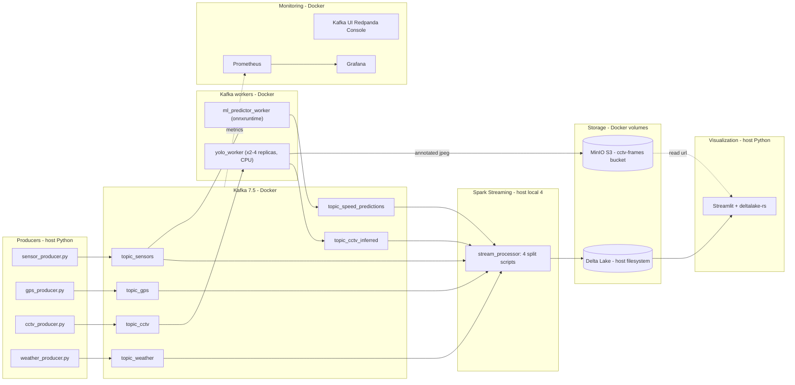

# Smart Traffic — Next-Level Rebuild Plan

## Goal

Rewrite [IMPLEMENTATION_PLAN.md](IMPLEMENTATION_PLAN.md) so it (a) folds in every reviewer critique, (b) fixes additional flaws I found while reading the source, and (c) stays **100% local on Windows + Docker Desktop, CPU-only, no AWS**.

## What changes vs the current plan

The current plan still contains five architectural anti-patterns. The rewrite removes them all and adds a sixth set of fixes I found during code review.

### Reviewer-flagged anti-patterns (must fix)

- **Sync HTTP from Spark to YOLO** — current Section 2 has `requests.post()` inside `foreachBatch`. Replace with a **pure Kafka-to-Kafka YOLO worker**: `topic_cctv` → YOLO container → `topic_cctv_inferred` → Spark writes Delta. No HTTP between Spark and YOLO.
- **Base64 thumbnails in Delta** — current Section 7.3 stores `frame_thumbnail_b64` in Parquet. Replace with **MinIO** object store: YOLO worker writes annotated JPEG to MinIO and emits only `frame_url` to Kafka. Delta stays narrow and fast.
- **MLlib in `foreachBatch` cold start** — reviewer warned about 3s of every 5s batch lost to MLlib init. Replace with a separate **Kafka-to-Kafka ML predictor microservice** using LightGBM + ONNX runtime. Keep `ml_predictor.py` MLlib trainer as the offline research baseline.
- **GPS producer `iterrows`** — replace with `df.to_dict('records')` (≈50× faster) plus chunked `producer.send` with `linger_ms=20`.
- **Streamlit flicker on autorefresh** — wrap heavy widgets (map, video feed) in `@st.fragment` so only metrics/tables redraw every 5s.

### Additional flaws I found in the source

- **Dead Spark containers**: `docker-compose.yml` defines `spark-master`/`spark-worker` but `stream_processor.py` uses `master("local[4]")` on the host. Decision: **remove the cluster containers**; keep Spark as local-mode on host (matches your Windows reality). Mounted volumes become inconsistent otherwise.
- **`spark.read.format("delta").load("delta_tables/graph_shortest_paths")` inside `foreachBatch`** ([spark_jobs/stream_processor.py](spark_jobs/stream_processor.py) line 145) — re-reads the entire shortest-paths table **every micro-batch**. Fix: load once at startup and `broadcast` it.
- **Dashboard `df.limit(500)` without `orderBy`** ([dashboard/app.py](dashboard/app.py) line 60) — gives **arbitrary** rows, not recent ones. Fix: `orderBy(col("timestamp").desc()).limit(N)`.
- **Dashboard spins up a new Spark session per refresh** — `@st.cache_resource` caches it but Streamlit `st.rerun()` at line 202 forces re-read of full tables every 5s. Fix: replace Spark in the dashboard with **`deltalake` (Rust-based, no JVM)** for 10× faster reads.
- **Kafka topics auto-created with default 1 partition** — caps consumer parallelism. Fix: add a one-shot `infra/init_topics.py` that creates each topic with 3 partitions and explicit retention.
- **No graceful shutdown** in any producer — Ctrl+C drops in-flight messages. Fix: SIGINT handler that calls `producer.flush(timeout=10)`.
- **`spark_jobs/stream_processor.py` runs four branches in one driver** — a single crash kills all four streams. Fix: split into four scripts driven by a top-level `run_streaming.ps1` so each can restart independently.
- **No idempotent Delta writes** — Spark restart after checkpoint gap duplicates rows. Fix: pass `.option("txnAppId", "...").option("txnVersion", batch_id)` on every Delta sink.
- **Unbounded Delta tables** — `sensor_speeds`, `cv_vehicle_counts`, `gps_trips` grow forever. Fix: `partitionBy("event_date")` and add a nightly `VACUUM` + `OPTIMIZE` job.
- **No `.dockerignore`** — `data/` and `delta_tables/` get sent to every build context. Fix: add one.
- **GPU config in current plan despite no GPU available** — strip out all NVIDIA runtime references.

## High-level revised architecture



Key invariant: **Spark never makes synchronous calls to external services**. Every heavy operation (YOLO, ML predict, S3 upload) happens in a dedicated Kafka worker. Spark only reads Kafka, joins broadcast tables, and writes Delta.

## Rewritten section map

The new [IMPLEMENTATION_PLAN.md](IMPLEMENTATION_PLAN.md) keeps the same 11-section outline but the bodies change as follows.

- **Section 1 — Diagnosed flaws**: add the 10 new flaws from "Additional flaws" above; reword 1.1 to make clear the fix is Kafka-to-Kafka, not HTTP.
- **Section 2 — YOLO**: completely replace. New design:
  - `yolo_worker/main.py` uses **`confluent-kafka-python`** (not `kafka-python` — confluent's lib has C bindings, ~5× throughput and proper consumer group rebalancing).
  - Consumes `topic_cctv`, runs `model.track(..., persist=True)` so **ByteTrack IDs survive across messages within a partition** (sticky partitioning by `camera_id` is essential — covered below).
  - Writes annotated JPEG to MinIO at `cctv-frames/{camera_id}/{frame_id}.jpg` using `boto3` (S3-compatible).
  - Publishes JSON `{camera_id, frame_id, timestamp, unique_count, track_ids, frame_url, inference_ms}` to `topic_cctv_inferred`.
  - Dockerfile uses `python:3.10-slim` + `ultralytics` CPU wheels + `yolov8n.pt` at `imgsz=480`.
  - `docker-compose.yml` runs **2 replicas by default** (`deploy.replicas: 2`) on a consumer group `yolo-workers`.
  - Spark side becomes a *trivial* `topic_cctv_inferred` → `cv_vehicle_counts` Delta sink — no HTTP, no UDF.
- **Section 3 — ML predictor**: replace with two-part design.
  - **Part A — offline trainer** (`ml/train_speed_model.py`): reads METR-LA (full set this time, not 1000 rows), engineers `hour, dow, lag_5min, lag_15min, lag_1h, rolling_mean_30min`, trains **LightGBM**, exports `models/speed_predictor.onnx` via `onnxmltools.convert_lightgbm`. Logs RMSE/R² to MLflow tracking server (also Dockerized).
  - **Part B — online worker** (`ml_predictor_worker/main.py`): confluent-kafka consumer of `topic_sensors`, maintains a per-sensor sliding window in-memory (deque), computes the same features, runs `onnxruntime.InferenceSession.run()`, publishes to `topic_speed_predictions`.
  - Keep `spark_jobs/ml_predictor.py` (MLlib) as the **research baseline** with a banner comment: "MLlib reference implementation — production inference uses LightGBM/ONNX in `ml_predictor_worker/`."
- **Section 4 — Double-counting**: keep Option B (ByteTrack) but add a critical detail. ByteTrack state must persist across Kafka messages for the same camera. Two requirements:
  1. **Sticky partitioning**: producer sets `key=camera_id.encode()` so all frames of one camera go to one partition and one worker.
  2. **Worker keeps `model.track(..., persist=True)` instance per `camera_id`**, in a `dict[camera_id, YOLO]`, since YOLO's tracker is stateful.
  3. Add a `unique_count_session` (since worker start) and `unique_count_window` (last 5 min, using a `collections.deque` of seen track IDs with timestamps) — the dashboard shows the windowed one.
- **Section 5 — CCTV producer**: as in current plan but add `--key-by camera_id` (already implied) and `--loop` mode that respects `KEYBOARD_INTERRUPT`. Also fix the awkward fallback logic at [producers/cctv_producer.py:30](producers/cctv_producer.py) (auto-detect vs flat layout) into a `--source-layout {detrac,flat,video}` CLI arg.
- **Section 6 — Dashboard**: keep tabbed redesign but replace Spark backend with `deltalake` Rust package. Wrap map and CCTV grid in `@st.fragment(run_every=5)`. Metrics row stays outside fragment so it autorefreshes via `st_autorefresh`.
- **Section 7 — New components**: rewrite 7.3 to use `frame_url` instead of base64. Add three new components:
  - **7.6 MinIO** with `make-bucket` init container that creates `cctv-frames` on startup.
  - **7.7 Topic initializer** `infra/init_topics.py` (one-shot) creating topics with 3 partitions, 24h retention.
  - **7.8 MLflow tracking server** Dockerized, used by the offline trainer.
- **Section 8 — Infrastructure**: rewritten `docker-compose.yml` (see snippet below). All services CPU-only. No `nvidia` runtime anywhere. `.dockerignore` added.
- **Section 9 — Diagram**: replace with the mermaid above.
- **Section 10 — Phases**: rewrite in 4 phases tightened for solo-dev pace (see below).
- **Section 11 — File-by-file**: rewrite to match the new files.

## Key snippets that go in the plan

### Rewritten `docker-compose.yml` core

```yaml
services:
  zookeeper:    # unchanged
  kafka:        # unchanged but add KAFKA_NUM_PARTITIONS: 3

  kafka-init:
    image: python:3.10-slim
    depends_on: { kafka: { condition: service_healthy } }
    volumes: ["./infra:/infra"]
    command: ["sh", "-c", "pip install confluent-kafka && python /infra/init_topics.py"]
    restart: "no"

  minio:
    image: minio/minio:latest
    command: server /data --console-address ":9001"
    ports: ["9000:9000", "9001:9001"]
    environment:
      MINIO_ROOT_USER: minioadmin
      MINIO_ROOT_PASSWORD: minioadmin
    volumes: ["minio-data:/data"]

  minio-init:
    image: minio/mc:latest
    depends_on: [minio]
    entrypoint: >
      sh -c "mc alias set local http://minio:9000 minioadmin minioadmin &&
             mc mb --ignore-existing local/cctv-frames &&
             mc anonymous set download local/cctv-frames"

  yolo-worker:
    build: ./yolo_worker
    depends_on: [kafka, minio]
    environment:
      KAFKA_BROKERS: kafka:29092
      MINIO_ENDPOINT: minio:9000
      INPUT_TOPIC: topic_cctv
      OUTPUT_TOPIC: topic_cctv_inferred
      CONSUMER_GROUP: yolo-workers
    deploy: { replicas: 2 }

  ml-predictor-worker:
    build: ./ml_predictor_worker
    depends_on: [kafka]
    environment:
      KAFKA_BROKERS: kafka:29092
      INPUT_TOPIC: topic_sensors
      OUTPUT_TOPIC: topic_speed_predictions

  kafka-ui:        # Redpanda Console
  prometheus:      # unchanged from current plan
  grafana:         # unchanged
  mlflow:
    image: ghcr.io/mlflow/mlflow:v2.13.0
    command: mlflow server --host 0.0.0.0 --backend-store-uri sqlite:///mlflow.db
    ports: ["5000:5000"]
    volumes: ["mlflow-data:/mlflow"]

volumes: { minio-data: {}, mlflow-data: {} }
```

Removed: `spark-master`, `spark-worker` (dead). Removed: any `nvidia` runtime stanza.

### YOLO worker core (`yolo_worker/main.py`)

```python
from confluent_kafka import Consumer, Producer
from ultralytics import YOLO
import boto3, json, base64, io, time
from PIL import Image

CAMERAS = {}  # camera_id -> YOLO instance (stateful tracker per camera)

def get_model(camera_id):
    if camera_id not in CAMERAS:
        CAMERAS[camera_id] = YOLO("weights/best.pt")
    return CAMERAS[camera_id]

s3 = boto3.client("s3", endpoint_url=f"http://{os.environ['MINIO_ENDPOINT']}",
                  aws_access_key_id="minioadmin", aws_secret_access_key="minioadmin")

consumer = Consumer({"bootstrap.servers": os.environ["KAFKA_BROKERS"],
                     "group.id": os.environ["CONSUMER_GROUP"],
                     "auto.offset.reset": "latest"})
consumer.subscribe([os.environ["INPUT_TOPIC"]])
producer = Producer({"bootstrap.servers": os.environ["KAFKA_BROKERS"], "linger.ms": 20})

while True:
    msg = consumer.poll(1.0)
    if msg is None or msg.error(): continue
    data = json.loads(msg.value())
    img = Image.open(io.BytesIO(base64.b64decode(data["frame_b64"]))).convert("RGB")
    t0 = time.time()
    res = get_model(data["camera_id"]).track(np.array(img), conf=0.3, persist=True, verbose=False)[0]
    ids = res.boxes.id.tolist() if res.boxes.id is not None else []
    annotated = Image.fromarray(res.plot())
    buf = io.BytesIO(); annotated.save(buf, "JPEG", quality=80)
    key = f"{data['camera_id']}/{data['frame_id']}.jpg"
    s3.put_object(Bucket="cctv-frames", Key=key, Body=buf.getvalue(), ContentType="image/jpeg")
    producer.produce(os.environ["OUTPUT_TOPIC"], key=data["camera_id"].encode(), value=json.dumps({
        "camera_id": data["camera_id"], "frame_id": data["frame_id"],
        "timestamp": data["timestamp"], "unique_count": len(set(ids)),
        "track_ids": ids, "frame_url": f"http://localhost:9000/cctv-frames/{key}",
        "inference_ms": (time.time() - t0) * 1000,
    }).encode())
```

### Spark CCTV branch becomes trivial

```python
inferred_schema = StructType([
    StructField("camera_id", StringType()), StructField("frame_id", StringType()),
    StructField("timestamp", FloatType()), StructField("unique_count", IntegerType()),
    StructField("track_ids", ArrayType(IntegerType())), StructField("frame_url", StringType()),
    StructField("inference_ms", FloatType()),
])
(spark.readStream.format("kafka").option("kafka.bootstrap.servers", KAFKA_SPARK)
 .option("subscribe", "topic_cctv_inferred").load()
 .select(from_json(col("value").cast("string"), inferred_schema).alias("d")).select("d.*")
 .withColumn("event_date", to_date(col("timestamp").cast("timestamp")))
 .writeStream.format("delta")
 .option("checkpointLocation", "delta_tables/checkpoints/cctv_inferred")
 .option("txnAppId", "cctv-inferred").partitionBy("event_date")
 .trigger(processingTime="5 seconds").start("delta_tables/cv_vehicle_counts"))
```

### Dashboard refactor — no Spark

```python
from deltalake import DeltaTable
import streamlit as st

@st.cache_data(ttl=5)
def read_table(name, n=500):
    return (DeltaTable(f"delta_tables/{name}").to_pandas()
            .sort_values("timestamp", ascending=False).head(n))

@st.fragment(run_every=5)
def cctv_grid():
    cv = read_table("cv_vehicle_counts", 20)
    cols = st.columns(4)
    for i, row in cv.head(4).iterrows():
        with cols[i % 4]:
            st.image(row["frame_url"], caption=f"{row['camera_id']} — {row['unique_count']}")
```

## Rewritten implementation phases

- **Phase 1 — Pure event-driven core (Week 1)**: MinIO + bucket init; topic initializer; YOLO Kafka worker (replicas=2, CPU yolov8n); Spark CCTV branch becomes Kafka-only sink; ByteTrack with sticky `camera_id` partitioning; CCTV producer rewrite with `--fps/--loop/--source-layout`; GPS producer `to_dict` fix; remove dead Spark containers.
- **Phase 2 — ML out of Spark (Week 2)**: LightGBM trainer + ONNX export to `models/speed_predictor.onnx`; MLflow tracking server; `ml_predictor_worker` consuming `topic_sensors`, producing `topic_speed_predictions`; Spark adds a fifth branch that just persists predictions. Keep MLlib trainer as baseline.
- **Phase 3 — Reliability & data quality (Week 3)**: DLQ tables (`dlq_sensors`, `dlq_cctv`, `dlq_gps`); per-batch latency tracking via `ingested_at`/`processed_at`; idempotent Delta writes (`txnAppId`); partition all high-volume tables by `event_date`; broadcast `graph_shortest_paths` instead of re-reading per batch; split `stream_processor.py` into four scripts; `run_streaming.ps1` launcher; nightly `OPTIMIZE`/`VACUUM` job (`spark_jobs/maintenance.py`).
- **Phase 4 — Dashboard + observability (Week 4)**: full dashboard rewrite using `deltalake-rs` + `@st.fragment` + `st_autorefresh` + pydeck map + ML scatter/residuals + alert feed; load `sensor_metadata` Delta; Kafka UI (Redpanda Console); Prometheus scraping Kafka JMX + worker metrics; Grafana dashboards for Kafka lag, worker FPS, Spark batch duration.

## Rewritten "what gets fixed" summary table

This replaces Section "Summary of What Was Wrong vs What Gets Fixed" in [IMPLEMENTATION_PLAN.md](IMPLEMENTATION_PLAN.md).

- YOLO called: random number → Kafka-to-Kafka worker, `model.track()` with ByteTrack IDs.
- Spark ↔ YOLO coupling: synchronous HTTP → none (pure Kafka).
- Image storage: base64 in Delta → MinIO object store, URLs in Delta.
- ML inference: static batch only → LightGBM/ONNX Kafka worker, sub-millisecond per row.
- Spark MLlib cold start cost: 3s/batch → 0 (MLlib stays for training only).
- GPS producer speed: 4+ hours via `iterrows` → minutes via `to_dict('records')` + chunked send.
- Streamlit flicker on refresh: full page redraw → `@st.fragment` partial refresh of heavy widgets.
- Streamlit + Spark coupling: spawns Spark per session → `deltalake-rs` reads, no JVM.
- Dashboard "latest" rows: arbitrary `limit(500)` → `orderBy(timestamp desc)` correct top-N.
- Re-reading `graph_shortest_paths` every batch: yes → broadcast once at startup.
- Single Spark driver for four streams: yes → four independent scripts, restart each separately.
- Idempotent writes: no → `txnAppId` on every Delta sink.
- Unbounded tables: yes → partitioned by `event_date`, nightly `VACUUM/OPTIMIZE`.
- Dead Spark containers in compose: yes → removed.
- GPU config despite no GPU: yes → stripped, CPU-only everywhere.
- Topics auto-created: yes → explicit init container with 3 partitions, retention.
- Graceful shutdown: missing → SIGINT handler with `producer.flush(timeout=10)` in every producer.
- Monitoring: none → Kafka UI + Prometheus + Grafana + MLflow.

## What the new IMPLEMENTATION_PLAN.md will look like

When you confirm, I'll do **one full rewrite of [IMPLEMENTATION_PLAN.md](IMPLEMENTATION_PLAN.md)** (≈1100–1300 lines) with:
- All 11 sections rewritten end-to-end (not patched).
- New mermaid architecture diagram (above).
- All code blocks updated to the Kafka-worker pattern.
- Complete `docker-compose.yml` sketch in Section 8 (no GPU, no dead containers).
- File-by-file change table reflecting the new `yolo_worker/`, `ml_predictor_worker/`, `infra/`, `monitoring/` directories.
- Quick Start at the bottom updated for the new service list.

No source files (`.py`, `.yml`, etc.) get touched in this plan — only the markdown gets rewritten. Implementation of the actual code is a separate execution pass once you approve the plan.