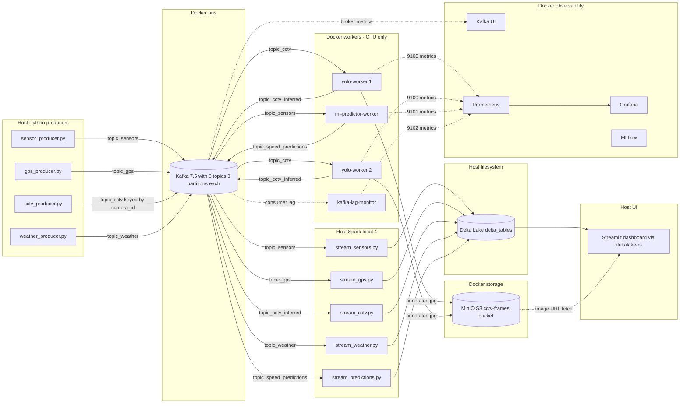

# Smart Traffic — Next-Level Industry-Standard Implementation Plan

> **Author:** Zubair Abbas | **Revised:** May 2026
> **Purpose:** Replace every architectural anti-pattern in the previous design with a pure event-driven Kafka-to-Kafka pipeline running entirely on **local Windows + Docker Desktop (CPU-only, no AWS)**.

---

## Table of Contents

1. [Diagnosed Flaws — Original Plan and Source Code](#1-diagnosed-flaws--original-plan-and-source-code)
2. [YOLO as a Kafka-to-Kafka Worker (Pure Event-Driven)](#2-yolo-as-a-kafka-to-kafka-worker-pure-event-driven)
3. [ML Predictor as ONNX Kafka Worker](#3-ml-predictor-as-onnx-kafka-worker)
4. [Vehicle Double-Counting Fix (Stateful ByteTrack)](#4-vehicle-double-counting-fix-stateful-bytetrack)
5. [CCTV Producer Redesign](#5-cctv-producer-redesign)
6. [Dashboard Overhaul (deltalake-rs + Fragments)](#6-dashboard-overhaul-deltalake-rs--fragments)
7. [New Components](#7-new-components)
8. [Infrastructure (docker-compose, CPU-only, No AWS)](#8-infrastructure-docker-compose-cpu-only-no-aws)
9. [Full Revised Architecture](#9-full-revised-architecture)
10. [Implementation Phases](#10-implementation-phases)
11. [File-by-File Change Summary](#11-file-by-file-change-summary)
12. [Quick Start](#12-quick-start)
13. [Migration from Old Pipeline](#13-migration-from-old-pipeline)
14. [Host vs Docker Responsibility Matrix](#14-host-vs-docker-responsibility-matrix)
15. [Summary — Before vs After](#15-summary--before-vs-after)

---

## 1. Diagnosed Flaws — Original Plan and Source Code

### 1.1 Reviewer-flagged architectural anti-patterns

| # | Flaw | Where | Why it is bad |
|---|---|---|---|
| A1 | **Synchronous HTTP from Spark to YOLO** | Old plan §2; `stream_processor.py` would call `requests.post(YOLO_URL, ...)` inside `foreachBatch` | Blocks Spark worker threads on network I/O; one slow YOLO response stalls the entire micro-batch. Spark and YOLO are now tightly coupled — if YOLO crashes, Spark crashes. Throughput ceiling = YOLO QPS, not Kafka. |
| A2 | **Base64 image blobs in Delta Lake** | Old plan §7.3 schema (`frame_thumbnail_b64`) | Parquet is columnar and optimised for numeric/string analytics. A 720p JPEG base64-encoded is ≈80 KB of text per row. Over a day this bloats `cv_vehicle_counts` to tens of GB, kills `OPTIMIZE`/`Z-ORDER`, and makes every dashboard read crawl. |
| A3 | **Spark MLlib `PipelineModel.transform()` inside `foreachBatch`** | Old plan §3 | MLlib has a high per-batch setup cost. On a 5-second micro-batch, model transformation init can eat 2–3 seconds. The hot path is starved. |
| A4 | **`pandas.iterrows()` on ~3M GPS rows** | `producers/gps_producer.py:45` | ~50× slower than `to_dict('records')`. Single file replay takes 4+ hours and never finishes a meaningful demo. |
| A5 | **`time.sleep(refresh_rate); st.rerun()` in Streamlit** | `dashboard/app.py:201` | Blocks the Streamlit server thread. Slow Delta reads + blocking sleep → timeouts. Full-page redraw flickers every refresh. |

### 1.2 Additional flaws found during source-code review

| # | Flaw | Location | Why it matters |
|---|---|---|---|
| B1 | **YOLO never called — `rand()` placeholder** | `spark_jobs/stream_processor.py:90` | Every vehicle count in the dashboard is a random integer between 5 and 25. The fine-tuned `models/yolo_traffic_model/weights/best.pt` is never loaded. |
| B2 | **Vehicle double-counting across consecutive frames** | `producers/cctv_producer.py:49` (`[:50]` frames per sequence) | UA-DETRAC sequences track the same vehicles for 50+ frames. Per-frame counting inflates the metric 10–30×. |
| B3 | **ML predictor is static batch only** | `spark_jobs/ml_predictor.py:56` (`[:1000]` timestamps) | Trains once on historical slice. The live sensor stream never touches the model. "Predictions vs actual" panel shows stale batch data. |
| B4 | **`graph_shortest_paths` re-read every micro-batch** | `spark_jobs/stream_processor.py:145` | `spark.read.format("delta").load(...)` inside `foreachBatch` re-reads the full table from disk on every batch. Should be loaded once at startup and broadcast. |
| B5 | **Dashboard `df.limit(500)` without `orderBy`** | `dashboard/app.py:60` | In Spark `limit(N)` returns *any* N rows (typically the first file scanned), not the most recent. The dashboard is showing arbitrary historical data, not "latest". |
| B6 | **Dashboard spins up a PySpark JVM per session** | `dashboard/app.py:32-49` | 3–8 second cold start before first paint. `@st.cache_resource` mitigates per-session but every full reload still pays the cost. Replace with `deltalake` (Rust) — 10–50 ms reads, no JVM. |
| B7 | **Dead Spark containers in `docker-compose.yml`** | `docker-compose.yml:44-74` | `spark-master` and `spark-worker` are defined and consume RAM, but `stream_processor.py:51` uses `master("local[4]")` on the host — they are never actually used. Volume mounts also create path inconsistency. |
| B8 | **Auto-created Kafka topics get 1 partition** | `docker-compose.yml:37` (`KAFKA_AUTO_CREATE_TOPICS_ENABLE: "true"`) | Caps consumer-group parallelism at one. Partition count cannot be safely reduced later, and increasing it breaks message ordering for existing keys. |
| B9 | **Single Spark driver for all four streams** | `spark_jobs/stream_processor.py:252` (`spark.streams.awaitAnyTermination()`) | A crash in any one branch (e.g., weather API schema change) brings down all four streams. No fault isolation. |
| B10 | **No idempotent Delta writes** | All `.write.format("delta").mode("append")` calls | Spark restart after a checkpoint gap can produce duplicate rows in `foreachBatch` sinks (sensors → `sensor_speeds` + `rerouting_alerts`). Need `txnAppId` + `txnVersion` on multi-table batch writes. |
| B11 | **Unbounded Delta tables** | All append-only sinks | `sensor_speeds`, `cv_vehicle_counts`, `gps_trips` grow forever. No `partitionBy("event_date")`, no nightly `VACUUM`/`OPTIMIZE`. |
| B12 | **Producers have no graceful shutdown** | All four producers | Ctrl+C drops in-flight Kafka messages. No SIGINT handler, no `producer.flush(timeout=10)`. |
| B13 | **No schema validation, no DLQ** | Stream processor | Malformed messages become silent `null`s. No bad-record table, no error reason recorded. |
| B14 | **No `.dockerignore`** | Repo root | `data/` and `delta_tables/` are sent to every Docker build context — slow builds, potential secret leakage. |
| B15 | **GPU runtime config despite no GPU available** | Old plan §2 (`devices: nvidia`) | User has no NVIDIA GPU on Windows or WSL. The `nvidia` runtime stanza fails to start on machines without `nvidia-container-toolkit`. Strip it out. |

### 1.3 Resource-budget reality check

Running everything on a single Windows laptop:

| Service | Approx RAM | Notes |
|---|---|---|
| Zookeeper + Kafka | ~1.5 GB | Kafka 7.5 default JVM heap |
| MinIO | ~200 MB | Idle, scales with object cache |
| 2× yolo-worker (yolov8n) | ~1.2 GB (600 MB each) | Per-camera model instances |
| ml-predictor-worker | ~200 MB | ONNX runtime is light |
| kafka-ui + prometheus + grafana + mlflow | ~1.2 GB | Phase 4 services |
| **Docker subtotal** | **≈ 4.3 GB** | |
| Host Spark driver (`local[4]`, 4g) | ~4 GB | |
| Host: 4× producers + Streamlit | ~1 GB | |
| **Grand total** | **≈ 9 GB** | Tight on 16 GB laptops with browser + IDE open |

Mitigations baked into the plan:
- **`mem_limit` and `cpus` on every compose service** so a runaway container fails fast instead of swap-thrashing the OS.
- **`docker-compose.minimal.yml`** that runs only Kafka + MinIO + 1 yolo-worker for fast dev iteration.
- **Default `--fps 2`** in the CCTV producer matches what 2 CPU yolo-worker replicas can sustain (~10–16 FPS combined).

---

## 2. YOLO as a Kafka-to-Kafka Worker (Pure Event-Driven)

### 2.1 The architecture in one sentence

`topic_cctv` → **yolo-worker** (Docker, CPU yolov8n, ByteTrack) → annotated JPEG to **MinIO**, JSON to `topic_cctv_inferred` → **Spark** appends to `cv_vehicle_counts` Delta.

Spark does **zero** image work. The worker is independent: restart it without restarting Spark. Restart Spark without restarting it.

### 2.2 Why `confluent-kafka` (not `kafka-python`)

The worker uses `confluent-kafka-python`, which wraps `librdkafka` (C library):
- ≈ 3–5× higher throughput than pure-Python `kafka-python`.
- Correct cooperative consumer-group rebalancing (`kafka-python` has known bugs in this area).
- Stable under sustained load.

### 2.3 Sticky partitioning is essential

The CCTV producer sets `key=camera_id.encode()`. Kafka guarantees order within a partition, so all frames from `cam_01` go to one partition → one worker → ByteTrack state stays consistent for that camera.

With `KAFKA_NUM_PARTITIONS=3` and 2 worker replicas, each worker owns ≈ 2–3 cameras worth of state.

### 2.4 Worker memory note

YOLOv8n is ~12 MB on disk but unpacks to ~150 MB resident per `YOLO()` instance. The worker maintains **one instance per `camera_id`** in a dict, because `model.track(..., persist=True)` keeps tracker state bound to the model instance — sharing one model across cameras would interleave ByteTrack IDs and produce garbage.

With sticky partitioning + 2 replicas, expected resident set ≈ 600 MB per worker. Monitor with `docker stats`. Fallback if RAM gets tight: single YOLO model + per-camera `ByteTracker` instances (more code, less RAM).

### 2.5 Backpressure / max-age frame dropping

If Kafka lag grows, the worker should drop stale frames rather than process them — a real-time CCTV inference on a 30-second-old frame is worthless.

```python
if time.time() - data["timestamp"] > FRAME_MAX_AGE_SEC:  # default 10s
    skipped_frames_total.inc()
    continue
```

Exposed as a Prometheus metric.

### 2.6 Per-worker Prometheus metrics

The worker exposes `/metrics` on port 9100 (Prometheus client):
- `yolo_frames_processed_total{camera_id}` — counter
- `yolo_frames_skipped_total{reason}` — counter (`stale`, `decode_error`, `s3_error`)
- `yolo_inference_seconds{camera_id}` — histogram
- `yolo_unique_count{camera_id}` — gauge
- `yolo_minio_upload_seconds` — histogram

### 2.7 File layout

```
yolo_worker/
├── Dockerfile
├── requirements.txt
├── main.py            # consumer loop, ByteTrack state, MinIO upload, /metrics
└── weights/
    └── best.pt        # mounted from ../models/yolo_traffic_model/weights/best.pt
```

### 2.8 Output message schema (`topic_cctv_inferred`)

```json
{
  "camera_id": "MVI_20011",
  "frame_id": "img00037.jpg",
  "timestamp": 1715000000.123,
  "unique_count": 7,
  "track_ids": [12, 18, 19, 21, 23, 27, 28],
  "frame_url": "http://localhost:9000/cctv-frames/MVI_20011/img00037.jpg",
  "inference_ms": 142.3,
  "model_version": "yolo_traffic_model_v1"
}
```

Validated by `schemas/cctv_inferred.json` (JSON Schema) at the worker boundary.

### 2.9 Spark CCTV branch — now trivial

```python
inferred_schema = StructType([
    StructField("camera_id", StringType()), StructField("frame_id", StringType()),
    StructField("timestamp", DoubleType()), StructField("unique_count", IntegerType()),
    StructField("track_ids", ArrayType(IntegerType())),
    StructField("frame_url", StringType()), StructField("inference_ms", FloatType()),
    StructField("model_version", StringType()),
])

(spark.readStream.format("kafka")
 .option("kafka.bootstrap.servers", KAFKA_SPARK)
 .option("subscribe", "topic_cctv_inferred")
 .option("startingOffsets", "latest").load()
 .select(from_json(col("value").cast("string"), inferred_schema).alias("d")).select("d.*")
 .withColumn("event_date", to_date(col("timestamp").cast("timestamp")))
 .writeStream.format("delta")
 .option("checkpointLocation", "delta_tables/checkpoints/cctv_inferred")
 .partitionBy("event_date")
 .trigger(processingTime="5 seconds")
 .start("delta_tables/cv_vehicle_counts"))
```

No `foreachBatch`, no HTTP, no UDF. Spark is a thin Kafka-to-Delta sink. Exactly-once is automatic via the checkpoint.

---

## 3. ML Predictor as ONNX Kafka Worker

### 3.1 Why move ML out of Spark entirely

The reviewer flagged MLlib's per-batch overhead (2–3 seconds of every 5-second micro-batch lost to initialisation). Extracting inference into a Kafka worker:
- Matches the YOLO worker pattern → consistent architecture.
- Eliminates JVM serialisation cost on the hot path.
- Lets the model be retrained and redeployed without touching Spark.

### 3.2 Two-part design

**Part A — Offline trainer (`ml/train_speed_model.py`)**
- Reads METR-LA (full dataset, not 1000 rows).
- Engineers features: `hour`, `dow`, `is_weekend`, `lag_5min`, `lag_15min`, `lag_1h`, `rolling_mean_30min`.
- Trains **LightGBM** (`lightgbm.LGBMRegressor`) — 10–50× faster than MLlib GBT.
- Exports to ONNX via `onnxmltools.convert_lightgbm` → `models/speed_predictor.onnx`.
- Logs run to MLflow (RMSE, R², feature importances, model artifact).

**Part B — Online worker (`ml_predictor_worker/main.py`)**
- `confluent-kafka` consumer subscribed to `topic_sensors`, sticky-partitioned by `sensor_id`.
- Per-sensor sliding window (`collections.deque(maxlen=N)`) in memory.
- On each message: compute the same features, run `onnxruntime.InferenceSession.run()` (~50–200 µs), publish to `topic_speed_predictions`.
- Exposes `/metrics` on port 9101.

### 3.3 In-memory state — warm start, no Redis

The deque is volatile: if the worker crashes, the first 30 minutes after restart have degraded predictions. **Fix without adding infra**: on boot, the worker reads the last 30 minutes from `delta_tables/sensor_speeds` (using `deltalake`) and primes every sensor's deque before subscribing to Kafka.

```python
from deltalake import DeltaTable
import pandas as pd

hist = DeltaTable("delta_tables/sensor_speeds").to_pandas()
cutoff = pd.Timestamp.now(tz="UTC") - pd.Timedelta(minutes=30)
hist = hist[pd.to_datetime(hist["timestamp"]) > cutoff]
for sensor_id, group in hist.sort_values("timestamp").groupby("sensor_id"):
    state[sensor_id] = deque(group[["speed", "timestamp"]].to_dict("records"),
                             maxlen=WINDOW_SIZE)
```

Cost: ≈ 1 second at startup. Crash recovery is now essentially seamless.

**Production-grade future work** (documented, not implemented now): replace the in-memory deque with a stateful stream processor (Faust or Kafka Streams) for fault-tolerant state with no warm-up assumptions.

### 3.4 Keep the MLlib trainer as research baseline

`spark_jobs/ml_predictor.py` is preserved with a banner comment:

```python
"""
MLlib reference implementation — research baseline retained for paper credibility.
Production inference uses LightGBM/ONNX in ml_predictor_worker/.
"""
```

This way we can A/B compare LightGBM-on-ONNX vs Spark MLlib GBT on identical features, which is itself a defensible research contribution.

---

## 4. Vehicle Double-Counting Fix (Stateful ByteTrack)

### 4.1 Root cause

UA-DETRAC's `img00001.jpg` through `img00050.jpg` are consecutive frames of the same scene. The original pipeline counts each frame independently, so a vehicle present for 30 frames is counted 30 times.

### 4.2 Fix

`model.track(img, persist=True, tracker="bytetrack.yaml")` assigns a stable integer ID to each detected vehicle across frames. Count only **unique IDs** per window.

### 4.3 Three required design choices

1. **Sticky partitioning** — the CCTV producer sets `key=camera_id.encode()` so all frames from `cam_01` are routed to the same Kafka partition, hence the same worker.
2. **Per-camera YOLO instance** — the worker maintains `models: dict[str, YOLO] = {}`, instantiating on first sight of a `camera_id`. Each instance carries its own tracker state.
3. **Two counts in the message** —
   - `unique_count_session`: distinct IDs seen since worker start (monotone).
   - `unique_count_5min`: distinct IDs seen in the last 5 minutes (sliding window via `collections.deque[(id, ts)]`).

The dashboard shows `unique_count_5min`.

### 4.4 Edge case — worker restart

If a yolo-worker restarts, ByteTrack IDs reset for every camera that worker owns. The dashboard will see a small spike (≤30 seconds of frames re-counted) then settle. Acceptable for a research prototype. A production fix would persist tracker state to disk, but that's out of scope.

---

## 5. CCTV Producer Redesign

### 5.1 Changes vs current

| Aspect | Before | After |
|---|---|---|
| Frame cap | hardcoded `[:50]` per sequence | `--frames-per-camera N` (default 500) |
| Replay speed | `time.sleep(0.04)` | `--fps FLOAT` (default 2 — see note) |
| Looping | exits after 250 frames | `--loop` flag |
| Source layout | auto-detect tangle | `--source-layout {detrac,flat,video}` |
| Kafka key | none (round-robin) | `key=camera_id.encode()` for sticky partitioning |
| Shutdown | abrupt | SIGINT handler → `producer.flush(timeout=10)` |
| Validation | none | `jsonschema.validate(msg, cctv_raw.json)` before send |

### 5.2 Default `--fps 2` — the math

Two CPU yolo-worker replicas running `yolov8n` at `imgsz=480` sustain ≈ 5–8 FPS each, so 10–16 FPS combined. Five cameras at `--fps 2` produces 10 FPS total — within budget. To push throughput, raise `deploy.replicas` to 4 or drop `imgsz` to 320.

---

## 6. Dashboard Overhaul (deltalake-rs + Fragments)

### 6.1 Major changes

1. **Replace Spark with `deltalake` (Rust)** — no JVM, no per-session cold start, 10–50 ms reads.
2. **Wrap heavy widgets in `@st.fragment`** — CCTV grid and pydeck map redraw independently from metrics tables; no flicker on every refresh.
3. **`st_autorefresh`** for non-fragment top-level metrics.
4. **`orderBy(col("timestamp").desc()).limit(N)`** so we show actual latest rows.
5. **Display CCTV frames by URL** (from MinIO) — `st.image(row["frame_url"])`.

### 6.2 Backend snippet

```python
from deltalake import DeltaTable
import streamlit as st
from streamlit_autorefresh import st_autorefresh

st_autorefresh(interval=5000, key="metrics_refresh")

@st.cache_data(ttl=5)
def read_table(name: str, n: int = 500, sort_col: str = "timestamp"):
    df = DeltaTable(f"delta_tables/{name}").to_pandas()
    if sort_col in df.columns:
        df = df.sort_values(sort_col, ascending=False).head(n)
    return df

@st.fragment(run_every=5)
def cctv_grid():
    cv = read_table("cv_vehicle_counts", 12)
    cols = st.columns(4)
    for i, (_, row) in enumerate(cv.head(8).iterrows()):
        with cols[i % 4]:
            st.image(row["frame_url"], caption=f"{row['camera_id']} — {row['unique_count_5min']} veh")

@st.fragment(run_every=10)
def congestion_map():
    sensors = read_table("sensor_speeds", 5000)
    meta = read_table("sensor_metadata", 500, sort_col=None)
    merged = sensors.merge(meta, on="sensor_id")
    # pydeck layer with speed-coloured scatterplot
    ...
```

### 6.3 New sections

- Live metrics header (4 `st.metric` cards with `delta=`).
- CCTV grid (fragment, run_every=5).
- Speed time-series line chart (pivot by sensor, last 100 timestamps).
- Congestion heatmap (pydeck, fragment, run_every=10).
- ML predictions: actual-vs-predicted scatter + residuals histogram (matplotlib).
- Rerouting alert feed (styled `st.error` cards).

---

## 7. New Components

### 7.1 JSON Schema validation (`schemas/`)

Lightweight middle ground between "nothing" and "Confluent Schema Registry":

```
schemas/
├── cctv_raw.json          # producer → topic_cctv
├── cctv_inferred.json     # yolo-worker → topic_cctv_inferred
├── sensors.json           # producer → topic_sensors
├── gps.json
├── weather.json
└── speed_predictions.json # ml-predictor-worker → topic_speed_predictions
```

Producers and workers `jsonschema.validate(msg, schema)` before send and after receive. Validation failures route to DLQ.

### 7.2 Dead-letter queues

Three Delta tables: `dlq_sensors`, `dlq_cctv`, `dlq_gps`. Each row has `original_payload (string)`, `error_reason`, `error_class`, `ingested_at`. Stream-processor `foreachBatch` handlers `validate → split valid/invalid → write invalid to DLQ`.

### 7.3 Sensor metadata table

One-shot batch job `spark_jobs/load_sensor_metadata.py` writes `sensor_id`, `lat`, `lon` from METR-LA's `graph_sensor_locations.csv` to `delta_tables/sensor_metadata`. Enables the pydeck congestion map.

### 7.4 Updated `cv_vehicle_counts` schema

```python
StructType([
    StructField("camera_id",          StringType()),
    StructField("frame_id",           StringType()),
    StructField("timestamp",          DoubleType()),
    StructField("unique_count_5min",  IntegerType()),
    StructField("unique_count_session", IntegerType()),
    StructField("track_ids",          ArrayType(IntegerType())),
    StructField("frame_url",          StringType()),
    StructField("inference_ms",       FloatType()),
    StructField("model_version",      StringType()),
    StructField("event_date",         DateType()),  # partition column
])
```

No `frame_thumbnail_b64`, no `vehicle_count` (random number).

### 7.5 Kafka lag monitor

`monitoring/kafka_lag_monitor.py` polls consumer-group lag for every topic every 15 seconds, exposes Prometheus metrics on `:9102`, optionally also writes to `delta_tables/kafka_lag_metrics`.

### 7.6 MinIO with auto-created bucket

- `minio` service (S3-compatible object store).
- `minio-init` one-shot container that creates `cctv-frames` bucket and sets anonymous-read.
- All annotated JPEGs uploaded by the yolo-worker land here.

### 7.7 Topic initialiser

`infra/init_topics.py` (one-shot Docker container) creates all six topics with 3 partitions each and 24 h retention. Idempotent (skips topics that exist). Every producer's `depends_on` chain waits for `service_completed_successfully`.

### 7.8 MLflow tracking server

`mlflow` container (port 5000) backed by SQLite. The offline trainer (`ml/train_speed_model.py`) logs every run with metrics, params, and the ONNX artifact.

### 7.9 End-to-end latency tracking

Producers stamp `ingested_at = time.time()`. Workers and Spark stamp `processed_at`. The difference is published as a Prometheus histogram per topic and persisted to `delta_tables/pipeline_latency` once per minute.

### 7.10 Prometheus metrics endpoints in workers

Without these, Grafana dashboards are empty. Each worker imports `prometheus_client`:

```python
from prometheus_client import start_http_server, Counter, Histogram, Gauge
start_http_server(9100)  # 9100 for yolo, 9101 for ml-predictor, 9102 for lag-monitor
```

Prometheus scrape config in `monitoring/prometheus.yml` targets each port.

### 7.11 Test suite (`tests/`)

Minimal pytest set, ~15 tests:

| File | Covers |
|---|---|
| `tests/test_schemas.py` | Every Kafka topic schema validates a known-good and rejects a known-bad payload |
| `tests/test_yolo_worker.py` | Per-camera state isolation, sliding-window unique count, stale-frame drop |
| `tests/test_producers.py` | JSON serialisation, key encoding for sticky partitioning |
| `tests/test_ml_features.py` | Feature engineering reproducibility (deque deterministic) |
| `tests/test_spark_validation.py` | DLQ routing for malformed sensor rows (uses `pytest-spark`) |
| `tests/test_graph_analytics.py` | PageRank top-N stable on a known toy graph |

`pytest.ini` configures `pytest-spark` Spark session. CI not added in Phase 1, but `pytest` is one line to run locally.

---

## 8. Infrastructure (docker-compose, CPU-only, No AWS)

### 8.1 What gets removed

- `spark-master` and `spark-worker` containers (dead — host Spark is used).
- Any `nvidia` runtime / `count: all` / `capabilities: [gpu]` stanzas (no GPU available).

### 8.2 What gets added (full service list)

| Service | Image | Port(s) | Purpose |
|---|---|---|---|
| `zookeeper` | confluentinc/cp-zookeeper:7.5.0 | 2181 | Kafka coordinator |
| `kafka` | confluentinc/cp-kafka:7.5.0 | 9092, 29092 | Message bus |
| `kafka-init` | python:3.10-slim | — | One-shot topic creation |
| `kafka-ui` | redpandadata/console:latest | 8080 | Topic inspector |
| `minio` | minio/minio:latest | 9000, 9001 | S3-compatible object store |
| `minio-init` | minio/mc:latest | — | One-shot bucket creation |
| `yolo-worker` (×2) | local build `./yolo_worker` | 9100/internal | CV inference + ByteTrack |
| `ml-predictor-worker` | local build `./ml_predictor_worker` | 9101/internal | ONNX speed prediction (Phase 2) |
| `kafka-lag-monitor` | local build `./monitoring/lag_monitor` | 9102/internal | Consumer-group lag (Phase 4) |
| `prometheus` | prom/prometheus:latest | 9090 | Metrics scraping |
| `grafana` | grafana/grafana:latest | 3000 | Dashboards |
| `mlflow` | ghcr.io/mlflow/mlflow:v2.13.0 | 5000 | Experiment tracking (Phase 2) |

### 8.3 Health checks (every long-running service)

Each compose service has a `healthcheck:` stanza so `depends_on: condition: service_healthy` works. Example for MinIO:

```yaml
healthcheck:
  test: ["CMD", "curl", "-f", "http://localhost:9000/minio/health/live"]
  interval: 10s
  timeout: 5s
  retries: 5
```

### 8.4 Resource limits

Every long-running service gets `mem_limit` and `cpus`:

```yaml
yolo-worker:
  mem_limit: 1g
  cpus: 1.0
```

Prevents one runaway container from OOM-ing the whole laptop.

### 8.5 `docker-compose.minimal.yml`

Override file for dev iteration: only `zookeeper`, `kafka`, `kafka-init`, `minio`, `minio-init`, and 1 `yolo-worker`. Run with:

```powershell
docker compose -f docker-compose.yml -f docker-compose.minimal.yml up -d
```

### 8.6 `.env` additions

```
# MinIO
MINIO_ENDPOINT=localhost:9000
MINIO_ENDPOINT_DOCKER=minio:9000
MINIO_ACCESS_KEY=minioadmin
MINIO_SECRET_KEY=minioadmin
MINIO_BUCKET=cctv-frames

# YOLO worker
YOLO_MODEL_PATH=weights/best.pt
YOLO_IMGSZ=480
YOLO_CONF=0.3
YOLO_FRAME_MAX_AGE_SEC=10
YOLO_WORKER_METRICS_PORT=9100
YOLO_MODEL_VERSION=yolo_traffic_model_v1

# Kafka topics
TOPIC_SENSORS=topic_sensors
TOPIC_GPS=topic_gps
TOPIC_CCTV=topic_cctv
TOPIC_CCTV_INFERRED=topic_cctv_inferred
TOPIC_WEATHER=topic_weather
TOPIC_SPEED_PREDICTIONS=topic_speed_predictions
KAFKA_NUM_PARTITIONS=3
KAFKA_RETENTION_MS=86400000

# CCTV producer
CCTV_REPLAY_FPS=2
CCTV_FRAMES_PER_CAMERA=500
CCTV_SOURCE_LAYOUT=detrac
CCTV_LOOP=false

# Streaming
CONGESTION_THRESHOLD_MPH=20.0
SPARK_DRIVER_MEMORY=4g
```

### 8.7 `.dockerignore`

```
data/
delta_tables/
models/
venv/
.git/
.vscode/
*.log
.env
```

### 8.8 `requirements.txt` additions (Phase 1)

```
confluent-kafka>=2.4.0
boto3>=1.34.0
jsonschema>=4.21.0
prometheus-client>=0.20.0
deltalake>=0.16.0
```

Phase 2+ adds: `lightgbm`, `onnx`, `onnxruntime`, `onnxmltools`, `mlflow`, `streamlit-autorefresh`, `pydeck`, `matplotlib`, `schedule`, `pytest`, `pytest-spark`.

---

## 9. Full Revised Architecture



### 9.1 Delta Lake table catalogue

| Table | Written by | Read by | Partition |
|---|---|---|---|
| `cv_vehicle_counts` | `stream_cctv.py` | dashboard | `event_date` |
| `sensor_speeds` | `stream_sensors.py` | dashboard, ml-worker warm start | `event_date` |
| `speed_predictions` | `stream_predictions.py` | dashboard | `event_date` |
| `rerouting_alerts` | `stream_sensors.py` (foreachBatch) | dashboard | — |
| `gps_trips` | `stream_gps.py` | dashboard | `event_date` |
| `weather` | `stream_weather.py` | dashboard | — |
| `sensor_metadata` | `load_sensor_metadata.py` (one-shot) | dashboard | — |
| `graph_pagerank` | `graph_analytics.py` (one-shot) | analysis | — |
| `graph_shortest_paths` | `graph_analytics.py` (one-shot) | `stream_sensors.py` (broadcast) | — |
| `dlq_sensors` / `dlq_cctv` / `dlq_gps` | stream processors | monitoring | — |
| `kafka_lag_metrics` | `kafka_lag_monitor.py` (Phase 4) | dashboard, Grafana | — |
| `pipeline_latency` | every stream | dashboard, Grafana | — |

---

## 10. Implementation Phases

### Phase 1 — Pure event-driven core (this PR)

| Task | File(s) |
|---|---|
| MinIO + bucket init container | `docker-compose.yml` |
| Topic initializer (idempotent, 3 partitions, 24h retention) | `infra/init_topics.py` |
| JSON Schema files for every topic | `schemas/*.json` |
| YOLO Kafka worker (CPU, yolov8n, per-camera ByteTrack, MinIO upload, Prometheus `/metrics`, stale-frame drop) | `yolo_worker/` |
| Remove dead Spark containers, NVIDIA stanzas | `docker-compose.yml` |
| Add `mem_limit`, `cpus`, `healthcheck` to every service | `docker-compose.yml` |
| `docker-compose.minimal.yml` for dev | new |
| CCTV producer: `--fps 2`, `--loop`, `--source-layout`, `key=camera_id`, SIGINT flush, jsonschema | `producers/cctv_producer.py` |
| GPS producer: `to_dict('records')`, chunked send, SIGINT | `producers/gps_producer.py` |
| Spark CCTV branch becomes plain `topic_cctv_inferred` → Delta sink | `spark_jobs/stream_processor.py` |
| Broadcast `graph_shortest_paths` (no per-batch re-read) | `spark_jobs/stream_processor.py` |
| `partitionBy("event_date")` on high-volume tables | `spark_jobs/stream_processor.py` |
| `.dockerignore` | new |
| `.env.example` expansion | `.env.example` |
| `requirements.txt` updates | `requirements.txt` |
| Host vs Docker matrix + migration note | `README.md` |

### Phase 2 — ML out of Spark

| Task | File(s) |
|---|---|
| Offline LightGBM trainer with full METR-LA features | `ml/train_speed_model.py` |
| ONNX export via `onnxmltools.convert_lightgbm` | same |
| MLflow tracking server in compose | `docker-compose.yml` |
| `ml-predictor-worker` (confluent-kafka, onnxruntime, deque warm-start from Delta) | `ml_predictor_worker/` |
| Fifth Spark branch: `topic_speed_predictions` → Delta | `spark_jobs/stream_predictions.py` |
| Keep MLlib trainer as research baseline (banner comment + MLflow logging) | `spark_jobs/ml_predictor.py` |

### Phase 3 — Reliability & data quality

| Task | File(s) |
|---|---|
| Schema validation + DLQ writes inside `foreachBatch` | `spark_jobs/stream_sensors.py` |
| Idempotent Delta writes (`txnAppId` + `txnVersion`) on multi-table batches | same |
| End-to-end latency tracking (`ingested_at`/`processed_at` → `pipeline_latency`) | all producers + stream procs |
| Split `stream_processor.py` into four independent scripts + `run_streaming.ps1` | `spark_jobs/stream_*.py` |
| Nightly `OPTIMIZE` + `VACUUM` job | `spark_jobs/maintenance.py` |
| Test suite (~15 pytest tests) | `tests/` |

### Phase 4 — Dashboard + observability

| Task | File(s) |
|---|---|
| Full dashboard rewrite (deltalake-rs + fragments + pydeck + autorefresh) | `dashboard/app.py` |
| Sensor metadata loader | `spark_jobs/load_sensor_metadata.py` |
| Kafka UI (Redpanda Console) | compose |
| Prometheus + Grafana with pre-built dashboards | compose + `monitoring/` |
| Kafka lag monitor service | `monitoring/lag_monitor/` |

---

## 11. File-by-File Change Summary

| File | Type | Summary |
|---|---|---|
| `IMPLEMENTATION_PLAN.md` | rewrite | This document |
| `docker-compose.yml` | rewrite | Remove Spark containers + NVIDIA; add Kafka init, MinIO + init, yolo-worker, healthchecks, mem_limit, cpus |
| `docker-compose.minimal.yml` | new | Override for dev: Kafka + MinIO + 1 yolo-worker only |
| `.dockerignore` | new | Keep `data/`, `delta_tables/`, etc. out of build context |
| `.env.example` | major edit | MinIO + YOLO worker + topic config + producer config |
| `requirements.txt` | edit | Add `confluent-kafka`, `boto3`, `jsonschema`, `prometheus-client`, `deltalake` |
| `schemas/cctv_raw.json` | new | Validation for `topic_cctv` payloads |
| `schemas/cctv_inferred.json` | new | Validation for `topic_cctv_inferred` payloads |
| `schemas/sensors.json` | new | Validation for `topic_sensors` payloads |
| `schemas/gps.json` | new | Validation for `topic_gps` payloads |
| `schemas/weather.json` | new | Validation for `topic_weather` payloads |
| `schemas/speed_predictions.json` | new | Validation for `topic_speed_predictions` payloads |
| `infra/init_topics.py` | new | One-shot idempotent topic initialiser (3 partitions, 24 h retention) |
| `yolo_worker/Dockerfile` | new | python:3.10-slim + CPU ultralytics + opencv-python-headless |
| `yolo_worker/requirements.txt` | new | confluent-kafka, ultralytics, boto3, prometheus-client, jsonschema, Pillow |
| `yolo_worker/main.py` | new | Consumer loop, per-camera YOLO+ByteTrack, MinIO upload, /metrics, stale-frame drop, SIGINT |
| `producers/cctv_producer.py` | rewrite | CLI args, sticky partitioning, schema validation, SIGINT |
| `producers/gps_producer.py` | edit | `to_dict('records')`, chunked send, SIGINT |
| `producers/sensor_producer.py` | minor | Add sticky key by `sensor_id`, SIGINT flush, validation |
| `producers/weather_producer.py` | minor | SIGINT flush, validation |
| `spark_jobs/stream_processor.py` | rewrite | CCTV branch consumes `topic_cctv_inferred`; broadcast shortest paths; partitionBy event_date; txnAppId on sensor foreachBatch |
| `monitoring/prometheus.yml` | new | Scrape config for yolo-worker, ml-predictor-worker, kafka, lag monitor |
| `README.md` | edit | Host vs Docker matrix, migration note, updated Quick Start |

---

## 12. Quick Start

```powershell
# 0. One-time migration (only if you have data from the old pipeline)
Move-Item delta_tables\cv_vehicle_counts delta_tables\_legacy_cv_vehicle_counts -ErrorAction SilentlyContinue
Remove-Item -Recurse -Force delta_tables\checkpoints\cctv -ErrorAction SilentlyContinue

# 1. Bring up infrastructure (full or minimal)
docker compose up -d                                       # full stack
# docker compose -f docker-compose.yml -f docker-compose.minimal.yml up -d  # dev

# 2. Verify
docker compose ps                                          # all healthy
curl http://localhost:9000/minio/health/live               # MinIO up
curl http://localhost:9100/metrics                         # yolo-worker /metrics

# 3. Batch prerequisites
python spark_jobs/graph_analytics.py                       # PageRank + shortest paths

# 4. Streaming
python spark_jobs/stream_processor.py

# 5. Producers (separate terminals)
python producers/sensor_producer.py
python producers/gps_producer.py
python producers/cctv_producer.py --fps 2 --loop --source-layout detrac
python producers/weather_producer.py

# 6. Dashboard (Phase 4 — runs against deltalake-rs)
streamlit run dashboard/app.py

# 7. UIs
# Kafka UI:    http://localhost:8080
# MinIO:       http://localhost:9001  (minioadmin / minioadmin)
# Grafana:     http://localhost:3000  (admin / admin)
# Prometheus:  http://localhost:9090
# MLflow:      http://localhost:5000
# Dashboard:   http://localhost:8501
```

---

## 13. Migration from Old Pipeline

If you have an existing `delta_tables/cv_vehicle_counts` from the previous pipeline, it has a different schema (random `vehicle_count` int; no `unique_count_*`, `frame_url`, etc.). Writing the new schema on top will throw `AnalysisException: A schema mismatch detected`.

```powershell
Move-Item delta_tables\cv_vehicle_counts delta_tables\_legacy_cv_vehicle_counts
Remove-Item -Recurse -Force delta_tables\checkpoints\cctv
```

Rerun the Quick Start. New CCTV writes go to a fresh table.

---

## 14. Host vs Docker Responsibility Matrix

The Kafka bootstrap address differs depending on where a process runs (Docker exposes two listeners for this reason).

| Component | Runs on | Kafka bootstrap | MinIO endpoint |
|---|---|---|---|
| `producers/sensor_producer.py` | Host Python | `localhost:9092` | — |
| `producers/gps_producer.py` | Host Python | `localhost:9092` | — |
| `producers/cctv_producer.py` | Host Python | `localhost:9092` | — |
| `producers/weather_producer.py` | Host Python | `localhost:9092` | — |
| `spark_jobs/stream_processor.py` | Host Python (`local[4]`) | `localhost:9092` (autodetected via `socket.getaddrinfo`) | — |
| `dashboard/app.py` | Host Python (Streamlit) | — (reads Delta via `deltalake-rs`) | `http://localhost:9000` |
| `yolo_worker` | Docker container | `kafka:29092` | `http://minio:9000` |
| `ml_predictor_worker` | Docker container | `kafka:29092` | — |
| `kafka_lag_monitor` | Docker container | `kafka:29092` | — |
| `prometheus`, `grafana`, `kafka-ui`, `mlflow` | Docker container | (only Kafka UI hits `kafka:29092`) | — |

---

## 15. Summary — Before vs After

| Concern | Before | After |
|---|---|---|
| YOLO called at all | No — `rand()` placeholder | Yes — Kafka-to-Kafka worker, real `model.track()` |
| Spark ↔ YOLO coupling | Synchronous HTTP planned | Zero — both only know about Kafka |
| Image storage | Base64 in Delta (planned) | MinIO, URL in Delta |
| Vehicle counting | Per-frame (10–30× inflation) | Per-camera ByteTrack IDs, 5-min sliding unique count |
| ML inference | Static batch only | LightGBM/ONNX Kafka worker (sub-ms) — Phase 2 |
| MLlib cold-start cost | 2–3 s every 5-s batch (planned) | 0 — MLlib used only for offline training |
| GPS producer | `iterrows()`, ≥ 4 hours | `to_dict('records')` + chunked, minutes |
| Streamlit refresh | Blocking `time.sleep` + `st.rerun()` | `st_autorefresh` + `@st.fragment` |
| Streamlit backend | PySpark JVM per session | `deltalake-rs`, no JVM |
| Latest-rows in dashboard | `limit(500)` (arbitrary) | `orderBy(timestamp desc).limit(N)` |
| `graph_shortest_paths` reads | Every batch from disk | Loaded once, broadcast |
| Fault isolation | Single driver for 4 streams | Four independent scripts |
| Idempotent writes | None | `txnAppId` + `txnVersion` on foreachBatch sinks |
| Unbounded tables | Yes | `partitionBy(event_date)` + nightly OPTIMIZE/VACUUM |
| Dead containers | `spark-master`, `spark-worker` | Removed |
| GPU runtime | Configured but no hardware | Removed; CPU-only with `yolov8n` at `imgsz=480` |
| Topic auto-create | 1 partition each | `kafka-init` creates 3 partitions, 24 h retention |
| Schema validation | None | `jsonschema` per topic + DLQ |
| Producer shutdown | Abrupt | SIGINT → `producer.flush(timeout=10)` |
| Compose health checks | Only Kafka | Every long-running service |
| Resource limits | None | `mem_limit` + `cpus` on every service |
| Observability | None | Kafka UI + Prometheus + Grafana + MLflow + worker `/metrics` |
| Sensor lat/lon | Absent | `sensor_metadata` Delta table powers pydeck map |

---

*Smart Traffic next-level rebuild — Zubair Abbas, 2026*
