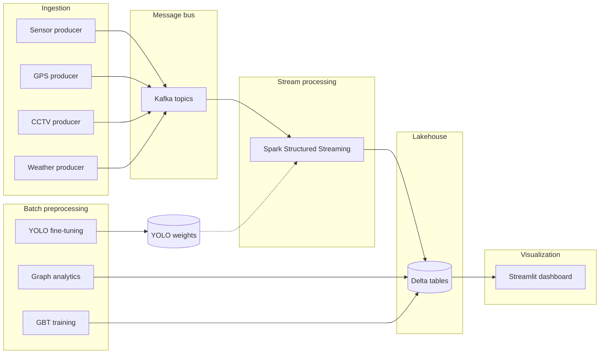

# Smart Traffic: Multimodal Streaming Analytics for Urban Traffic Intelligence

**Keywords:** intelligent transportation systems (ITS), stream processing, Apache Kafka, Apache Spark, Delta Lake, graph analytics, congestion detection, gradient boosting, YOLOv8, reproducible pipelines.

---

## Abstract

Urban traffic management increasingly relies on **heterogeneous data streams**—loop detectors, floating-car probes, video, and environmental sensors—processed under latency and consistency constraints. This repository implements an **end-to-end experimental pipeline** that (i) ingests multiple modalities through **Apache Kafka**, (ii) processes them with **Apache Spark Structured Streaming** and **Delta Lake** for fault-tolerant append-only storage, (iii) applies **NetworkX**–based **PageRank** and **multi-source shortest paths** on a road-sensor graph derived from **METR-LA**, (iv) trains a **gradient-boosted tree (GBT)** regressor for short-term speed estimation, (v) fine-tunes **YOLOv8** for vehicle detection on **UA-DETRAC** imagery, and (vi) exposes aggregated signals through a **Streamlit** dashboard. The design emphasizes **reproducibility** (pinned dependencies, explicit topic schemas, checkpoint locations) and **separation of batch graph precomputation** from **online congestion-triggered rerouting hints**. The codebase targets **Windows** workstations with **Docker Desktop** and **Python 3.10**, reflecting common institutional lab environments.

---

## 1. Motivation and problem statement

Classical traffic studies often assume batch, centralized analytics; modern ITS scenarios instead require:

1. **Continuous ingestion** of high-volume streams with decoupled producers and consumers.
2. **Unified storage** that supports concurrent batch reads (dashboards, model training) and stream writes (micro-batches).
3. **Fusion of modalities**—e.g., correlating low-speed episodes on the sensor graph with demand proxies (taxi trips) and optional weather context.
4. **Actionable subgraph queries** when congestion is detected (e.g., distances to landmark nodes in a precomputed routing layer).

This work does **not** claim a production-ready city deployment; it provides a **controlled research testbed** to study integration patterns, schema design, and evaluation hooks (e.g., RMSE for regression, qualitative inspection of rerouting tables).

---

## 2. Research objectives

| ID | Objective |
|----|-----------|
| O1 | Model a **lambda-style** architecture: streaming layer (Kafka + Spark) with **ACID-friendly** lakehouse tables (Delta). |
| O2 | Maintain **alignment** between discrete graph vertex indices and streaming **sensor_index** payloads for joinable rerouting semantics. |
| O3 | Quantify **predictive** performance of a lightweight temporal feature set on METR-LA speeds (GBT; RMSE, R²). |
| O4 | Demonstrate **embedded computer vision** in Spark via **pandas UDF** execution paths for CCTV-derived vehicle counts. |
| O5 | Document **limitations** (sample size, synthetic scaling assumptions, single-machine Spark) for scientific transparency. |

---

## 3. System architecture

### 3.1 Logical layers

- **Sensing / simulation layer:** Python producers emit JSON to Kafka topics (replay from public datasets or APIs).
- **Stream processing layer:** Spark Structured Streaming consumes topics, validates schemas, applies transformations, writes Delta tables, and triggers **foreachBatch** congestion logic.
- **Batch analytics layer:** Offline jobs materialize graph metrics and ML artifacts consumed by streaming and visualization.
- **Presentation layer:** Streamlit reads Delta snapshots via Spark SQL for exploratory monitoring.

### 3.2 Architecture diagram



---

## 4. Data sources and modalities

All datasets remain subject to their **original licenses**; obtain data independently and cite appropriately in publications.

| Modality | Dataset | Role in this repo | Typical path |
|----------|---------|-------------------|--------------|
| Freeway speeds | **METR-LA** | Sensor stream, adjacency-driven graph $G$, GBT training features | `data/metr-la/METR-LA.h5`, `adj_mat.npy` or `adj_METR-LA.pkl` |
| Demand proxy | **NYC TLC** yellow taxi | Zone-level trip records → GPS topic | `data/nyc-taxi/yellow_tripdata_2022-01.parquet` |
| Video / detection | **UA-DETRAC** | YOLO training; CCTV replay | `data/ua-detrac/…` → `yolo_format/` via `scripts/convert_yolo_fast.py` |
| Weather | **OpenWeatherMap** API | Optional exogenous stream | `.env` API key |

**Schema alignment (rerouting):** Order sensors like the columns of the METR-LA adjacency matrix used to build $G$. Each message must include **`sensor_index`** as an integer in $\{0,\ldots,n-1\}$ where $n=\lvert V\rvert$, so streaming joins match vertex ids `"0"` … `"n-1"` in `graph_shortest_paths`.

---

## 5. Methodology

### 5.1 Graph construction and centrality

Let $A \in \mathbb{R}^{\lvert V\rvert \times \lvert V\rvert}$ be the adjacency matrix (METR-LA). A **directed graph** $G=(V,E)$ is formed with an edge $i \to j$ when $A_{ij}>0$ and $i\neq j$. **PageRank** with damping $\alpha=0.85$ (implemented via `networkx.pagerank`) yields a stationary score per vertex as a proxy for **structural importance** in the sensor network. **Shortest-path lengths** from each vertex to fixed landmarks $\mathcal{L}=\{0,50,100\}$ are stored as sparse maps for downstream alerts.

### 5.2 Congestion detection and rerouting artifacts

At micro-batch time $t$, let $S_t$ be the set of readings with speed $v < \tau$ (implementation: $\tau = 20$ mph). For each congested index $k \in S_t$ with valid `sensor_index`, the pipeline **filters** precomputed rows where `id == str(k)` and **appends** matching shortest-path structures to `delta_tables/rerouting_alerts`. This encodes a **reactive subgraph lookup** rather than a full dynamic traffic assignment solver—appropriate for a research prototype.

### 5.3 Speed prediction (supervised)

**Features:** hour-of-day, day-of-week, Unix timestamp (via `unix_timestamp`). **Label:** reported speed. **Model:** Spark MLlib **GBTRegressor** within a pipeline with **standardized** assembled features (see `spark_jobs/ml_predictor.py`). **Note:** The default configuration trains on a **prefix** of timestamps (`[:1000]`) to bound memory on commodity hardware; ablations should vary this window and report sensitivity.

**Reported metrics:** RMSE and $R^2$ on a held-out split (80/20, seed 42).

### 5.4 Computer vision branch

**YOLOv8** is fine-tuned on UA-DETRAC annotations converted to a single-class detection task (`vehicle`) for **density-oriented counting**. In streaming, a **pandas UDF** decodes base64 JPEGs and runs inference (`conf=0.3`), emitting integer **vehicle counts per frame**. Model weights are expected at `models/yolo_traffic_model/weights/best.pt`; absence degrades to zero counts with logged warnings.

---

## 6. Kafka topic specification

| Topic | Payload summary |
|-------|-------------------|
| `topic_sensors` | `timestamp`, `sensor_id`, **`sensor_index`**, `speed` |
| `topic_gps` | pickup/dropoff times, TLC zones, trip distance |
| `topic_cctv` | `camera_id`, `frame_id`, `timestamp`, `frame_b64` |
| `topic_weather` | normalized current-weather fields + API metadata |

Topics may be **auto-created** by the broker; explicit creation is recommended for controlled partition counts in experiments.

---

## 7. Software environment and reproducibility

### 7.1 Core pinned stack

From `requirements.txt` (non-exhaustive): **PySpark 3.4.0**, **delta-spark 2.4.0**, **kafka-python 2.0.2**, **ultralytics 8.0.200**, **streamlit 1.29.0**, **networkx 3.3**, plus numerical stack (**numpy**, **pandas**, **h5py**, etc.). Spark packages resolved at runtime include **`delta-core_2.12:2.4.0`** and **`spark-sql-kafka-0-10_2.12:3.4.0`** (see `stream_processor.py`).

### 7.2 Infrastructure

- **Java 11** for Spark (`JAVA_HOME`).
- **Docker Compose:** Zookeeper + Kafka (dual listeners: host `9092`, internal `29092`). Optional Spark containers; default jobs use **local** Spark masters on the host (`local[4]` / `local[*]`).

### 7.3 Configuration

Use the tracked template **`.env.example`**: copy it to **`.env`** and fill in secrets locally. **`.env` is gitignored** — do not commit it or paste keys into issues or pull requests.

```powershell
copy .env.example .env
```

Variables include `OPENWEATHER_API_KEY`, `KAFKA_BOOTSTRAP_SERVERS`, optional `WEATHER_TOPIC` / `WEATHER_POLL_SECONDS`, and Spark paths (`DATA_DIR`, `DELTA_DIR`, `MODELS_DIR`, `SPARK_DRIVER_MEMORY`). See `.env.example` for the full list.

---

## 8. Experimental protocol (recommended order)

1. **Infrastructure:** `docker compose up -d`; verify Kafka health.
2. **Batch prerequisites:**  
   `python spark_jobs/graph_analytics.py`  
   `python spark_jobs/ml_predictor.py`
3. **Streaming:** `python spark_jobs/stream_processor.py` (maintains checkpoints under `delta_tables/checkpoints/`).
4. **Producers:** sensor, GPS, CCTV, weather (`producers/*.py`) as independent processes.
5. **Visualization:** `streamlit run dashboard/app.py` (default [http://localhost:8501](http://localhost:8501)).

**Training CV (offline):**  
`python scripts/convert_yolo_fast.py` → `python spark_jobs/train_yolo.py`

**Spark UI (compose mapping):** host port **8090** → container **8080** when using the provided `docker-compose.yml`.

---

## 9. Evaluation and validity

| Aspect | What to report |
|--------|----------------|
| Regression | RMSE, $R^2$ from `ml_predictor.py` stdout; sensitivity to training window size |
| Detection | mAP / precision-recall from Ultralytics logs (not wired automatically into Delta) |
| Streaming | End-to-end latency (Kafka lag, batch interval), idempotency after checkpoint reset |
| Rerouting | Row counts in `rerouting_alerts` vs. ground-truth incident labels (if simulated) |

**Threats to validity:** single-city graphs; taxi demand as a coarse proxy for congestion; YOLO counts without camera calibration; **no** online calibration of $\tau$; local Spark **without** cluster fault-injection tests.

---

## 10. Limitations and future work

- **Scale:** Designed for lab-scale replay; cluster deployment and exactly-once semantics require further engineering.
- **Routing:** Shortest paths on a **static** topology do not reflect time-varying travel times.
- **Privacy:** Base64 frames and trip records are sensitive; this prototype assumes **local, trusted** execution.
- **Extensions:** Online learning for GBT, Graph Neural Networks on $G$, uncertainty quantification for predictions, integration with open routing APIs.

---

## 11. Ethics, privacy, and responsible use

Use **only data you are licensed to hold**. Do not commit API keys, raw video, or personally identifiable information. For publications, follow dataset and API **terms of use** and acknowledge institutional review where human subjects or identifiable mobility traces apply.

---

## 12. Repository layout

```
smart-traffic/
├── producers/           # Kafka publishers (modal replay / APIs)
├── spark_jobs/          # Streaming + batch Spark jobs
├── scripts/             # Conversion utilities; optional GraphFrames JAR fetch
├── dashboard/           # Streamlit monitoring
├── data/                # Local datasets (gitignored)
├── delta_tables/        # Delta output + checkpoints (gitignored)
├── models/              # Artifacts (gitignored where large)
├── docker-compose.yml
├── requirements.txt
├── .env.example          # Template only — copy to .env (not committed)
├── LICENSE
└── README.md
```

---

## 13. Operational troubleshooting

| Symptom | Diagnostic focus |
|---------|------------------|
| Kafka connectivity | Bootstrap URL, Docker listener map (`localhost:9092` vs `kafka:29092`) |
| Empty rerouting | Prior run of `graph_analytics.py`; presence of `sensor_index` in payloads |
| Delta read failures in UI | Matching Delta JAR / extensions with streaming configuration |
| JVM errors | Java 11 availability and `JAVA_HOME` |

---

## 14. References (datasets and systems)

1. METR-LA traffic speed dataset (widely used benchmark; obtain via original distributor / Zenodo mirror per your institution’s policy).
2. NYC Taxi & Limousine Commission. *TLC Trip Record Data* — [https://www.nyc.gov/site/tlc/about/tlc-trip-record-data.page](https://www.nyc.gov/site/tlc/about/tlc-trip-record-data.page)
3. UA-DETRAC Multi-Camera Tracking and Detection — [https://detrac-db.rit.albany.edu/](https://detrac-db.rit.albany.edu/)
4. Apache Spark / Structured Streaming (Apache Software Foundation) — [https://spark.apache.org/](https://spark.apache.org/)
5. Kreps, J., Narkhede, N., Rao, J. Apache Kafka — [https://kafka.apache.org/](https://kafka.apache.org/)
6. Armbrust, M. et al. Delta Lake — [https://delta.io/](https://delta.io/)
7. Jocher, G. et al. Ultralytics YOLOv8 — [https://github.com/ultralytics/ultralytics](https://github.com/ultralytics/ultralytics)

---

## 15. Citation (example BibTeX for this artifact)

If you use this codebase as a software artifact in a paper, adapt as needed:

```bibtex
@software{smart_traffic_2026,
  title        = {Smart Traffic: Multimodal Streaming Analytics for Urban Traffic Intelligence},
  author       = {Abbas, Zubair},
  year         = {2026},
  url          = {https://github.com/zubiiabbasi/smart-traffic},
  note         = {Kafka, Spark Structured Streaming, Delta Lake, YOLOv8, NetworkX pipeline}
}
```

---

## Security

If you find a security issue in **this repository’s code**, open a private vulnerability report via GitHub (**Security → Report a vulnerability**) if enabled, or contact the maintainer without posting secrets. **Never** share API keys, `.env` contents, or raw mobility/video data in public issues.

---

## License and attribution

**Source code** in this repository is released under the **[MIT License](LICENSE)** (Copyright © 2026 Zubair Abbas). You may use a different license for your own fork if you replace `LICENSE` accordingly.

**Datasets and external services** (**METR-LA**, **NYC TLC**, **UA-DETRAC**, **OpenWeatherMap**, etc.) remain under their **respective terms**; this project does not redistribute them. Obtain data and keys yourself and cite primary sources in publications.

If you need **copyleft** or **no-commercial-use** terms for the code instead of MIT, replace `LICENSE` before publishing and update this section.
