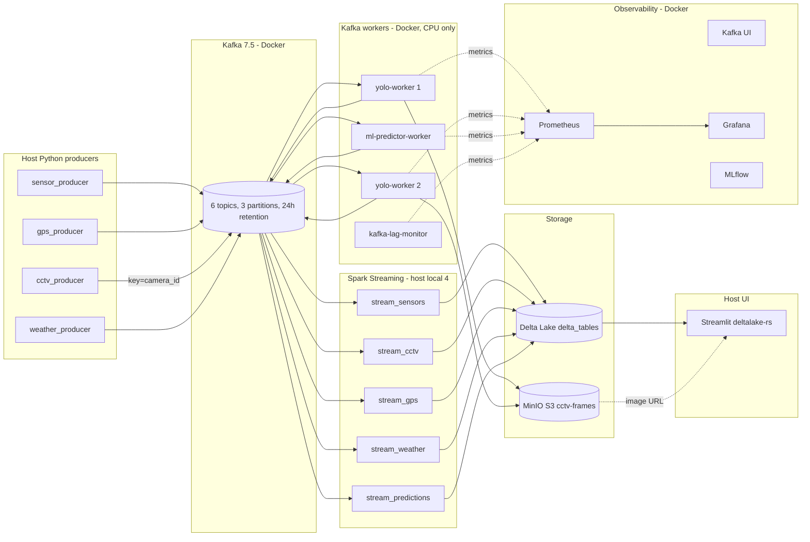

# Smart Traffic — Multimodal Streaming Analytics for Urban Traffic Intelligence

**Keywords:** intelligent transportation systems (ITS), stream processing, Apache Kafka, Apache Spark, Delta Lake, MinIO, YOLOv8 + ByteTrack, LightGBM + ONNX, MLflow, NetworkX graph analytics, Streamlit, Prometheus + Grafana.

**Maintainer:** [Zubair Abbas](https://github.com/zubiiabbasi) · Repository: [github.com/zubiiabbasi/smart-traffic](https://github.com/zubiiabbasi/smart-traffic)

---

## 1. What this is

A complete, **CPU-only, single-laptop** smart-traffic pipeline that demonstrates the modern event-driven streaming architecture:

- **Pure Kafka-to-Kafka workers** for every heavy operation (no synchronous coupling between Spark and CV/ML).
- **Object store (MinIO) for binary data**, Delta Lake for structured analytics — neither bloats the other.
- **Stateful per-camera / per-sensor workers** with sticky partitioning so ByteTrack IDs and sliding windows survive across messages.
- **ONNX-served ML** with a warm-start trick that reads recent history from Delta on boot — no Redis required.
- **Schema validation + DLQ + idempotent writes + nightly OPTIMIZE/VACUUM** end-to-end.
- **Streamlit + pydeck dashboard** and **Grafana auto-provisioned panels** for live monitoring.

The system targets **Windows + Docker Desktop + Python 3.10** without GPU. Everything runs locally.

---

## 2. Quick start

```powershell
# Clone
git clone https://github.com/zubiiabbasi/smart-traffic.git
cd smart-traffic

# Python env on host
py -3.10 -m venv venv
.\venv\Scripts\Activate.ps1
pip install -r requirements.txt

# Local config (already gitignored)
copy .env.example .env
# Edit .env if needed (OPENWEATHER_API_KEY etc.)

# (If migrating from an earlier pipeline) wipe stale state:
Remove-Item -Recurse -Force delta_tables\* -ErrorAction SilentlyContinue

# Bring up the full Docker stack
docker compose up -d
```

Then follow **§7 Run the pipeline**.

---

## 3. Architecture



**Key invariant:** Spark never makes a synchronous call to any external service. Every heavy operation (CV inference, ML inference, S3 upload) happens in a dedicated Kafka worker. Spark only reads Kafka, joins broadcast tables, and writes Delta.

---

## 4. Project structure

```
smart-traffic/
├── dashboard/                    # Streamlit (deltalake-rs, pydeck, fragments)
│   └── app.py
├── data/                         # Datasets (gitignored, populated by you)
│   └── .gitkeep
├── delta_tables/                 # Delta Lake output (gitignored)
│   └── .gitkeep
├── docker-compose.yml            # Full stack
├── docker-compose.minimal.yml    # Dev override (no Grafana/Prometheus)
├── infra/
│   └── init_topics.py            # One-shot Kafka topic creator
├── logs/                         # Streaming logs from run_streaming.ps1
│   └── .gitkeep
├── ml/
│   └── train_speed_model.py      # LightGBM trainer → ONNX export → MLflow
├── ml_predictor_worker/          # Kafka-to-Kafka ONNX worker (Phase 2)
│   ├── Dockerfile
│   ├── main.py
│   └── requirements.txt
├── models/
│   ├── yolo_traffic_model/       # Fine-tuned YOLOv8 (your weights here)
│   │   └── weights/best.pt
│   └── speed_predictor/          # Trainer output lands here
│       ├── speed_predictor.onnx
│       └── speed_predictor_meta.json
├── monitoring/
│   ├── grafana/
│   │   ├── dashboards/smart-traffic.json    # Pre-built 9-panel dashboard
│   │   └── provisioning/                    # Auto-load on boot
│   ├── lag_monitor/              # Consumer-group lag → Prometheus
│   │   ├── Dockerfile
│   │   ├── main.py
│   │   └── requirements.txt
│   └── prometheus.yml
├── producers/                    # Host Python producers
│   ├── cctv_producer.py
│   ├── gps_producer.py
│   ├── sensor_producer.py
│   └── weather_producer.py
├── schemas/                      # JSON Schema per Kafka topic
│   ├── cctv_inferred.json
│   ├── cctv_raw.json
│   ├── gps.json
│   ├── sensors.json
│   ├── speed_predictions.json
│   └── weather.json
├── scripts/
│   ├── convert_yolo_fast.py      # UA-DETRAC XML → YOLO labels
│   └── run_streaming.ps1         # Launch all 5 streams as host processes
├── spark_jobs/
│   ├── _common.py                # Shared Spark session factory
│   ├── graph_analytics.py        # NetworkX PageRank + shortest paths
│   ├── load_sensor_metadata.py   # METR-LA lat/lon → Delta (one-shot)
│   ├── maintenance.py            # Nightly OPTIMIZE + VACUUM
│   ├── ml_predictor.py           # MLlib baseline (deprecated, A/B reference)
│   ├── stream_sensors.py         # Sensors + DLQ + reroute + latency tracking
│   ├── stream_cctv.py            # topic_cctv_inferred → cv_vehicle_counts
│   ├── stream_gps.py
│   ├── stream_weather.py
│   ├── stream_predictions.py
│   └── train_yolo.py             # YOLO fine-tuning (CV side)
├── tests/                        # 22 pytest unit tests, no infra needed
│   ├── conftest.py
│   ├── test_graph_analytics.py
│   ├── test_ml_features.py
│   ├── test_producers.py
│   ├── test_schemas.py
│   └── test_worker_state.py
├── yolo_worker/                  # Kafka-to-Kafka YOLO worker (Phase 1)
│   ├── Dockerfile
│   ├── main.py
│   └── requirements.txt
├── IMPLEMENTATION_PLAN.md        # Full design rationale (Phase 1-4)
├── pytest.ini
├── requirements.txt
├── .dockerignore
├── .env.example
├── .gitignore
└── README.md
```

---

## 5. Host vs Docker — where does each process run?

Two Kafka listeners exposed on purpose: **host processes use `localhost:9092`, Docker workers use `kafka:29092`**. The producers and Spark autodetect.

| Component | Runs on | Kafka bootstrap | MinIO endpoint |
|---|---|---|---|
| `producers/*.py` | Host Python | `localhost:9092` | — |
| `spark_jobs/stream_*.py` (×5) | Host Python (`local[2]`) | `localhost:9092` (autodetect) | — |
| `dashboard/app.py` | Host Python | (none — reads Delta) | `http://localhost:9000` |
| `yolo-worker` (×2 replicas) | Docker | `kafka:29092` | `http://minio:9000` |
| `ml-predictor-worker` | Docker | `kafka:29092` | — |
| `kafka-lag-monitor` | Docker | `kafka:29092` | — |
| `kafka-ui`, `prometheus`, `grafana`, `mlflow` | Docker | (browser → published port) | — |

---

## 6. Service URLs after `docker compose up -d`

| URL | What |
|---|---|
| http://localhost:8501 | **Streamlit dashboard** — 5 tabs: Live CCTV, Map, ML, Alerts, Explorer |
| http://localhost:8080 | **Kafka UI** (Redpanda Console) — topics, consumer groups, messages |
| http://localhost:9001 | **MinIO console** (`minioadmin` / `minioadmin`) — annotated frames |
| http://localhost:5000 | **MLflow** — training runs, metrics, ONNX artifacts |
| http://localhost:3000 | **Grafana** (`admin` / `admin`) — auto-loads Smart Traffic dashboard |
| http://localhost:9090 | **Prometheus** — raw metrics + scrape targets |
| http://localhost:9100/metrics | YOLO worker metrics directly |
| http://localhost:9101/metrics | ML predictor worker metrics directly |
| http://localhost:9102/metrics | Kafka lag monitor metrics directly |

---

## 7. Run the pipeline

The order matters: infra → batch prerequisites → ML training → streaming jobs → producers → dashboard.

### 7.1 Infrastructure (one terminal, runs in background)

```powershell
docker compose up -d
docker compose ps      # all healthy; kafka-init + minio-init should be "Exited (0)"
```

### 7.2 Batch prerequisites (one-shot, do once after first clone)

```powershell
python spark_jobs/graph_analytics.py        # NetworkX PageRank + shortest paths
python spark_jobs/load_sensor_metadata.py   # METR-LA lat/lon → sensor_metadata
python ml/train_speed_model.py              # LightGBM → ONNX → MLflow
                                            # Outputs models/speed_predictor/*

# Recreate the ml-worker so it loads the freshly trained ONNX:
docker compose up -d --force-recreate ml-predictor-worker
```

### 7.3 Streaming jobs (5 host terminals or use the launcher)

**Option A — one combined launch (recommended for laptop):**

```powershell
.\scripts\run_streaming.ps1
# Logs land in logs\stream_*.log — tail with:
Get-Content logs\stream_sensors.log -Wait -Tail 30
# Stop all five:
.\scripts\run_streaming.ps1 -StopAll
```

**Option B — one terminal per branch (max fault isolation):**

```powershell
python spark_jobs/stream_sensors.py
python spark_jobs/stream_cctv.py
python spark_jobs/stream_gps.py
python spark_jobs/stream_weather.py
python spark_jobs/stream_predictions.py
```

### 7.4 Producers (one terminal each)

```powershell
python producers/sensor_producer.py
python producers/cctv_producer.py --fps 2 --loop --source-layout detrac
python producers/gps_producer.py --rate 200 --limit 50000
python producers/weather_producer.py
```

### 7.5 Dashboard

```powershell
streamlit run dashboard/app.py
# → http://localhost:8501
```

### 7.6 Nightly maintenance (optional, schedule with Windows Task Scheduler)

```powershell
python spark_jobs/maintenance.py
```

---

## 8. Tests

22 fast unit tests cover schema validation, feature engineering, per-sensor worker state, producer round-trips, and graph analytics. **No Kafka / Spark / Docker required.**

```powershell
pytest
```

---

## 9. Data sources

All datasets remain subject to their **original licenses**.

| Modality | Dataset | Local path | Why we need it |
|---|---|---|---|
| Freeway speeds | **METR-LA** | `data/metr-la/METR-LA.h5`, `adj_mat.npy`, `graph_sensor_locations.csv` | Sensor stream + graph + ML training + map |
| Demand proxy | **NYC TLC** yellow taxi | `data/nyc-taxi/yellow_tripdata_2022-01.parquet` | GPS topic |
| Video / detection | **UA-DETRAC** | `data/ua-detrac/DETRAC-Images/<sequence>/img*.jpg` | YOLO training + CCTV replay |
| Weather | **OpenWeatherMap** API | `.env` API key | Optional exogenous stream |

---

## 10. Phase summary (what was built and why)

| Phase | Theme | Key files |
|---|---|---|
| **1** | Pure event-driven CV pipeline | `yolo_worker/`, `infra/init_topics.py`, MinIO compose service, CCTV producer rewrite, GPS `to_dict` fix, JSON schemas, host-vs-Docker matrix, removed NVIDIA + Spark containers |
| **2** | ML out of Spark | `ml/train_speed_model.py`, `ml_predictor_worker/`, MLflow service, ONNX export + warm-start from Delta, fifth Spark branch |
| **3** | Reliability + tests | DLQ + idempotent writes + latency tracking in `stream_sensors.py`, split 5 streaming scripts, `_common.py`, `maintenance.py`, `run_streaming.ps1`, producer SIGINT + schema validation, 22 pytest tests |
| **4** | Dashboard + observability | `dashboard/app.py` (deltalake-rs + `@st.fragment` + pydeck), `load_sensor_metadata.py`, `monitoring/lag_monitor/`, Grafana auto-provisioned 9-panel dashboard, Prometheus scrape config |

The full design rationale, reviewer critique, and per-flaw resolution is in **`IMPLEMENTATION_PLAN.md`**.

---

## 11. Operational troubleshooting

| Symptom | Where to look |
|---|---|
| Kafka connectivity | `KAFKA_BOOTSTRAP_SERVERS` in `.env`; `kafka:29092` vs `localhost:9092` listener split |
| No YOLO frames in MinIO | `docker compose logs -f yolo-worker`; verify `models/yolo_traffic_model/weights/best.pt` exists |
| Empty rerouting alerts | Run `python spark_jobs/graph_analytics.py` first; check `sensor_index` is in producer payloads |
| ML predictor crashes on boot | `models/speed_predictor/speed_predictor.onnx` missing — run `ml/train_speed_model.py` and recreate the worker |
| Streamlit map shows "no metadata" | Run `python spark_jobs/load_sensor_metadata.py` |
| YOLO container OOM | Lower `--fps`, drop `YOLO_IMGSZ` to 320, or raise `mem_limit` in `docker-compose.yml` |
| Prometheus target down | Check the worker is up: `docker compose ps`, `curl http://localhost:910x/metrics` from host |

---

## 12. Security and license

- **Code:** [MIT License](LICENSE) © 2026 Zubair Abbas.
- **Datasets:** subject to their original terms (METR-LA, UA-DETRAC, NYC TLC, OpenWeatherMap). Obtain and cite yourself.
- **Local dev defaults:** MinIO bucket `cctv-frames` is set to anonymous-read so the Streamlit dashboard (running on host) can fetch images by URL without an SDK. Do not expose this on a network. Replace with presigned URLs before any deployment.
- **Never commit `.env`.** It is gitignored.

---

## 13. Citation (BibTeX)

```bibtex
@software{smart_traffic_2026,
  title  = {Smart Traffic: Multimodal Streaming Analytics for Urban Traffic Intelligence},
  author = {Abbas, Zubair},
  year   = {2026},
  url    = {https://github.com/zubiiabbasi/smart-traffic},
  note   = {Kafka, Spark Structured Streaming, Delta Lake, MinIO, YOLOv8+ByteTrack,
            LightGBM+ONNX, MLflow, NetworkX, Streamlit, Prometheus+Grafana}
}
```
