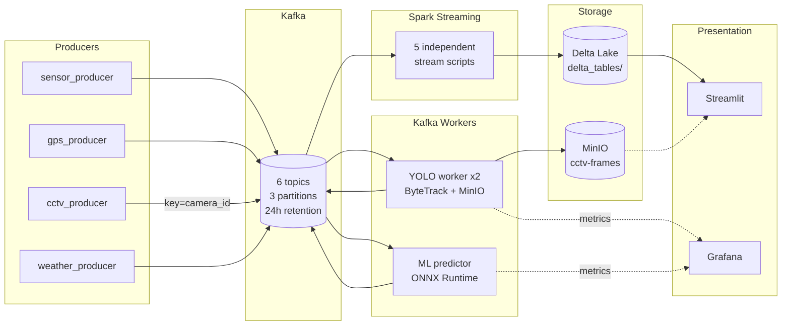

# Smart Traffic: Multimodal Streaming Analytics for Urban Traffic Intelligence

**Keywords:** intelligent transportation systems (ITS), stream processing, Apache Kafka, Apache Spark Structured Streaming, Delta Lake, MinIO, graph analytics, congestion detection, gradient-boosted trees, YOLOv8, ByteTrack, LightGBM, ONNX Runtime, MLflow, reproducible pipelines.

---

## Abstract

Urban traffic management increasingly relies on **heterogeneous data streams** — loop detectors, floating-car probes, video feeds, and environmental sensors — processed under latency and consistency constraints. This repository implements an **end-to-end experimental pipeline** that

1. Ingests four modalities through **Apache Kafka** (6 topics, 3 partitions each, 24-hour retention);
2. Delegates compute-intensive inference to **dedicated Kafka-to-Kafka microservices** — a CPU-based **YOLOv8 + ByteTrack** worker for vehicle detection and tracking, and a **LightGBM → ONNX Runtime** worker for short-term speed prediction;
3. Stores annotated video frames in **MinIO** (S3-compatible object storage) and structured analytics in **Delta Lake** via **Spark Structured Streaming** with exactly-once, partitioned, idempotent writes;
4. Applies **NetworkX**-based **PageRank** and **multi-source shortest paths** on a road-sensor graph derived from **METR-LA**;
5. Exposes real-time signals through a **Streamlit** dashboard with fragment-based partial refresh and a **pydeck** congestion heat map; and
6. Monitors pipeline health via **Prometheus** metrics, **Grafana** auto-provisioned dashboards, and a dedicated Kafka consumer-lag monitor.

The design emphasizes **separation of concerns**: Spark never makes synchronous calls to external services; every heavy operation (CV inference, ML inference, object-store upload) runs in an independent worker that communicates exclusively through Kafka. The system targets **Windows workstations with Docker Desktop** and requires no GPU.

---

## 1. Motivation and problem statement

Classical traffic studies often assume batch, centralised analytics; modern ITS scenarios instead require:

1. **Continuous ingestion** of high-volume streams with decoupled producers and consumers.
2. **Unified storage** that supports concurrent batch reads (dashboards, model training) and stream writes (micro-batches) with ACID guarantees.
3. **Fusion of modalities** — correlating low-speed episodes on the sensor graph with demand proxies (taxi trips), video-derived vehicle counts, and optional weather context.
4. **Actionable subgraph queries** when congestion is detected (e.g., shortest-path distances to landmark nodes from a precomputed routing layer).

This work provides a **controlled research testbed** to study integration patterns, schema design, fault tolerance, and evaluation hooks across these requirements.

---

## 2. System architecture

### 2.1 Logical layers

- **Sensing / simulation layer.** Python producers replay public datasets (METR-LA, NYC TLC, UA-DETRAC) and poll the OpenWeatherMap API, emitting JSON to Kafka topics. Sticky partitioning by `camera_id` or `sensor_id` ensures stateful downstream consumers receive temporally ordered messages per entity.
- **Inference layer.** Two Dockerised Kafka workers operate as independent consumer-producer pairs:
  - *YOLO worker* (2 replicas): consumes raw base64 frames, runs `model.track()` with ByteTrack for cross-frame vehicle ID persistence, uploads annotated JPEGs to MinIO, and emits a compact JSON result to `topic_cctv_inferred`.
  - *ML predictor worker*: maintains a per-sensor sliding window (`collections.deque`), computes temporal and lag features identical to the offline trainer, and runs sub-millisecond ONNX inference to produce speed predictions on `topic_speed_predictions`.
- **Stream processing layer.** Five independent Spark Structured Streaming scripts consume their respective topics and write to partitioned Delta Lake tables with checkpoint-based exactly-once semantics. The sensors branch additionally performs schema validation with dead-letter routing and real-time congestion detection via broadcast join against precomputed graph shortest paths.
- **Batch analytics layer.** Offline jobs materialise graph metrics (PageRank, shortest-path distances), sensor location metadata, and train the LightGBM speed model with MLflow experiment tracking.
- **Presentation layer.** A Streamlit dashboard reads Delta snapshots via the Rust-based `deltalake` package (no JVM) and fetches annotated frames by URL from MinIO. Fragment-based partial refresh ensures heavy widgets (map, CCTV grid) update independently without page flicker. Prometheus and Grafana provide infrastructure-level monitoring.

### 2.2 Architecture diagram



### 2.3 Design invariant

> *Spark never makes synchronous calls to external services.* Every heavy operation (CV inference, ML inference, S3 upload) occurs in a dedicated Kafka worker. Spark only reads Kafka, joins broadcast tables, and writes Delta.

---

## 3. Data sources

All datasets remain subject to their **original licences**; obtain data independently and cite appropriately.

| Modality | Dataset | Role | Typical path |
|----------|---------|------|--------------|
| Freeway speeds | **METR-LA** | Sensor stream, adjacency-driven graph $G$, GBT training features | `data/metr-la/METR-LA.h5`, `adj_mat.npy` |
| Demand proxy | **NYC TLC** yellow taxi | Zone-level trip records | `data/nyc-taxi/yellow_tripdata_2022-01.parquet` |
| Video / detection | **UA-DETRAC** | YOLO fine-tuning; CCTV replay | `data/ua-detrac/DETRAC-Images/<sequence>/` |
| Weather | **OpenWeatherMap** API | Optional exogenous stream | `.env` API key |

---

## 4. Methodology

### 4.1 Graph construction and centrality

Let $A \in \mathbb{R}^{|V| \times |V|}$ be the METR-LA adjacency matrix. A directed graph $G = (V, E)$ is formed with edge $i \to j$ when $A_{ij} > 0$ and $i \neq j$. **PageRank** with damping $\alpha = 0.85$ yields a stationary importance score per vertex. **Shortest-path lengths** from each vertex to fixed landmarks $\mathcal{L} = \{0, 50, 100\}$ are stored for downstream congestion-triggered rerouting.

### 4.2 Congestion detection and rerouting

At micro-batch time $t$, let $S_t = \{k : v_k < \tau\}$ where $\tau = 20$ mph. For each congested sensor $k \in S_t$ with valid `sensor_index`, the streaming job filters broadcast shortest-path rows where `id == str(k)` and appends matching structures to `rerouting_alerts`. Invalid rows (null fields, out-of-range speeds) are routed to a dead-letter queue (`dlq_sensors`) with error metadata.

### 4.3 Vehicle detection and tracking

**YOLOv8n** fine-tuned on UA-DETRAC (`imgsz=480`, `conf=0.3`) runs inside a Kafka worker with `model.track(persist=True, tracker="bytetrack.yaml")`. Per-camera model instances maintain isolated ByteTrack state via sticky Kafka partitioning (`key=camera_id`). A 5-minute sliding window of track IDs (`collections.deque`) yields `unique_count_5min` — the deduplicated vehicle count reported to the dashboard. Stale frames (age > 10 s) are dropped to bound latency under backpressure.

### 4.4 Speed prediction

**Offline training.** `ml/train_speed_model.py` reads the full METR-LA dataset, engineers per-sensor features (hour-of-day, day-of-week, is-weekend, lag at 5/15/60 minutes, 30-minute rolling mean), and trains a **LightGBM** regressor. The model is exported to **ONNX** via `onnxmltools` and logged to **MLflow** with hyperparameters, metrics (RMSE, MAE, $R^2$), and feature importances.

**Online inference.** `ml_predictor_worker/main.py` consumes `topic_sensors`, maintains a per-sensor `deque(maxlen=12)`, computes the identical feature set, and runs `onnxruntime.InferenceSession.run()` (~50–200 $\mu$s per row on CPU). On boot, the worker primes its windows by reading the last 30 minutes from `delta_tables/sensor_speeds` via the Rust-based `deltalake` package, eliminating cold-start prediction degradation.

A Spark MLlib GBT baseline (`spark_jobs/ml_predictor.py`) is retained for A/B comparison.

---

## 5. Infrastructure

### 5.1 Docker Compose services

| Service | Image / Build | Port | Purpose |
|---------|---------------|------|---------|
| Zookeeper | confluentinc/cp-zookeeper:7.5.0 | 2181 | Kafka coordination |
| Kafka | confluentinc/cp-kafka:7.5.0 | 9092, 29092 | Message bus (host + internal listeners) |
| kafka-init | python:3.10-slim | — | One-shot topic creation (idempotent) |
| MinIO | minio/minio:latest | 9000, 9001 | S3-compatible object store |
| minio-init | minio/mc:latest | — | One-shot bucket creation |
| yolo-worker (x2) | `./yolo_worker` | 9100 | CV inference + ByteTrack + MinIO upload |
| ml-predictor-worker | `./ml_predictor_worker` | 9101 | ONNX speed prediction |
| kafka-lag-monitor | `./monitoring/lag_monitor` | 9102 | Consumer-group lag metrics |
| MLflow | ghcr.io/mlflow/mlflow:v2.13.0 | 5000 | Experiment tracking |
| Kafka UI | redpandadata/console:latest | 8080 | Topic / consumer-group inspector |
| Prometheus | prom/prometheus:latest | 9090 | Metrics scraping |
| Grafana | grafana/grafana:latest | 3000 | Auto-provisioned dashboards |

All services run **CPU-only** on **Docker Desktop for Windows** with explicit `mem_limit` and `cpus` constraints. A `docker-compose.minimal.yml` override drops monitoring services for resource-constrained development.

### 5.2 Host processes

| Process | Kafka bootstrap | Notes |
|---------|-----------------|-------|
| `producers/*.py` (x4) | `localhost:9092` | Sticky key partitioning, jsonschema validation, SIGINT flush |
| `spark_jobs/stream_*.py` (x5) | `localhost:9092` (autodetect) | Independent fault isolation; launched via `scripts/run_streaming.ps1` |
| `dashboard/app.py` | — (reads Delta) | `deltalake`-rs, `@st.fragment`, `st_autorefresh`, `pydeck` |

### 5.3 Schema contracts

JSON Schema files in `schemas/` define the message contract for every Kafka topic. Producers and workers validate payloads at publish and receive boundaries; violations are counted as Prometheus metrics and, on the Spark side, routed to dead-letter tables.

---

## 6. Delta Lake table catalogue

| Table | Written by | Partition | Key contents |
|-------|-----------|-----------|--------------|
| `cv_vehicle_counts` | stream_cctv | `event_date` | `unique_count_5min`, `track_ids`, `frame_url`, `inference_ms` |
| `sensor_speeds` | stream_sensors | `event_date` | `sensor_id`, `speed`, `sensor_index` |
| `speed_predictions` | stream_predictions | `event_date` | `actual_speed`, `predicted_speed`, `model_version` |
| `rerouting_alerts` | stream_sensors | — | `sensor_id`, `speed`, `distances` (to landmarks) |
| `gps_trips` | stream_gps | `event_date` | Pickup/dropoff zones, distance |
| `weather` | stream_weather | — | Temperature, humidity, wind, conditions |
| `sensor_metadata` | load_sensor_metadata | — | `sensor_id`, `lat`, `lon` |
| `graph_pagerank` | graph_analytics | — | Vertex importance scores |
| `graph_shortest_paths` | graph_analytics | — | Landmark distance maps |
| `dlq_sensors` | stream_sensors | — | Failed rows + error reason |
| `pipeline_latency` | stream_sensors | — | Per-batch timing summaries |

---

## 7. Observability

- **Prometheus** scrapes three worker endpoints every 15 s: YOLO worker (`:9100`), ML predictor (`:9101`), Kafka lag monitor (`:9102`).
- **Grafana** auto-provisions a 10-panel *Smart Traffic — Pipeline Overview* dashboard on first boot, covering frame throughput, inference latency distributions, unique vehicle counts, prediction rates, and consumer-group lag per topic.
- The Kafka lag monitor polls broker metadata every 15 s and exposes `kafka_consumer_lag`, `kafka_log_end_offset`, and `kafka_committed_offset` as Prometheus gauges.

---

## 8. Experimental protocol

```powershell
# 1. Clone and configure
git clone https://github.com/zubiiabbasi/smart-traffic.git
cd smart-traffic
py -3.10 -m venv venv
.\venv\Scripts\Activate.ps1
pip install -r requirements.txt
copy .env.example .env            # edit: add OPENWEATHER_API_KEY

# 2. Infrastructure
docker compose up -d

# 3. Batch prerequisites (one-shot)
python spark_jobs/graph_analytics.py
python spark_jobs/load_sensor_metadata.py
python ml/train_speed_model.py
docker compose up -d --force-recreate ml-predictor-worker

# 4. Streaming (5 independent Spark drivers)
.\scripts\run_streaming.ps1

# 5. Producers (separate terminals)
python producers/sensor_producer.py
python producers/cctv_producer.py --fps 2 --loop --source-layout detrac
python producers/gps_producer.py --rate 200 --limit 50000
python producers/weather_producer.py

# 6. Dashboard
streamlit run dashboard/app.py          # http://localhost:8501

# 7. Monitoring
# Kafka UI:       http://localhost:8080
# MinIO console:  http://localhost:9001  (minioadmin / minioadmin)
# MLflow:         http://localhost:5000
# Grafana:        http://localhost:3000  (admin / admin)
# Prometheus:     http://localhost:9090
```

---

## 9. Repository layout

```
smart-traffic/
├── dashboard/app.py                    Streamlit dashboard (deltalake-rs, pydeck, fragments)
├── infra/init_topics.py                One-shot Kafka topic initialiser
├── ml/train_speed_model.py             LightGBM trainer → ONNX → MLflow
├── ml_predictor_worker/                Kafka-to-Kafka ONNX inference worker
│   ├── Dockerfile
│   ├── main.py
│   └── requirements.txt
├── monitoring/
│   ├── grafana/                        Auto-provisioned datasource + dashboard
│   ├── lag_monitor/                    Consumer-group lag → Prometheus
│   └── prometheus.yml
├── producers/                          Host Python producers (sensor, cctv, gps, weather)
├── schemas/                            JSON Schema per Kafka topic (6 files)
├── scripts/
│   ├── convert_yolo_fast.py            UA-DETRAC XML → YOLO labels
│   └── run_streaming.ps1              Launch / stop all 5 stream scripts
├── spark_jobs/
│   ├── _common.py                      Shared Spark session factory
│   ├── graph_analytics.py              NetworkX PageRank + shortest paths
│   ├── load_sensor_metadata.py         METR-LA lat/lon → Delta
│   ├── maintenance.py                  Nightly OPTIMIZE + VACUUM
│   ├── ml_predictor.py                 MLlib GBT baseline (A/B reference)
│   ├── stream_sensors.py              Sensors + DLQ + reroute + latency
│   ├── stream_cctv.py
│   ├── stream_gps.py
│   ├── stream_weather.py
│   ├── stream_predictions.py
│   └── train_yolo.py                   YOLOv8 fine-tuning on UA-DETRAC
├── yolo_worker/                        Kafka-to-Kafka YOLO + ByteTrack worker
│   ├── Dockerfile
│   ├── main.py
│   └── requirements.txt
├── docker-compose.yml
├── docker-compose.minimal.yml          Dev override (no monitoring stack)
├── requirements.txt
├── .dockerignore
├── .env.example
├── .gitignore
├── LICENSE
└── README.md
```

---

## 10. Evaluation and validity

| Aspect | What to report |
|--------|----------------|
| Speed regression | RMSE, MAE, $R^2$ from `ml/train_speed_model.py` stdout and MLflow |
| Detection quality | mAP / precision-recall from Ultralytics logs (`train_yolo.py`) |
| Streaming reliability | End-to-end latency (`pipeline_latency` Delta table), DLQ row counts, consumer-group lag trends (Grafana) |
| Rerouting correctness | Row counts in `rerouting_alerts` vs. simulated congestion scenarios |
| Vehicle deduplication | `unique_count_5min` vs. raw frame-level detection counts per camera |

**Threats to validity.** Single-city graph; taxi demand as a coarse congestion proxy; YOLO counts without camera calibration; no online calibration of the congestion threshold $\tau$; local Spark without cluster fault-injection tests; synthetic lat/lon when `graph_sensor_locations.csv` is absent.

---

## 11. Limitations and future work

- **Scale.** Designed for lab-scale replay on a single Windows laptop; cluster deployment and exactly-once Kafka consumers require further engineering.
- **Routing.** Shortest paths on a static topology do not reflect time-varying travel times; integration with open routing APIs (OSRM, Valhalla) would improve realism.
- **Model evolution.** The current ONNX export is manual; a production system would use MLflow Model Registry with automatic promotion and worker rolling restart.
- **Video streaming.** The dashboard displays frames at 2-second intervals; a dedicated MJPEG server would provide smoother real-time video.
- **Graph neural networks.** Replacing the GBT with a spatio-temporal GNN (e.g., DCRNN, Graph WaveNet) that exploits the road topology is the current research frontier for METR-LA.
- **Privacy.** Base64 frames and trip records are sensitive; this prototype assumes local, trusted execution.

---

## 12. Ethics, privacy, and responsible use

Use **only data you are licensed to hold**. Do not commit API keys, raw video, or personally identifiable information. For publications, follow dataset and API terms of use and acknowledge institutional review where human subjects or identifiable mobility traces apply.

---

## 13. References

1. METR-LA traffic speed dataset (widely used benchmark; obtain via original distributor / Zenodo mirror).
2. NYC Taxi & Limousine Commission. *TLC Trip Record Data* — https://www.nyc.gov/site/tlc/about/tlc-trip-record-data.page
3. UA-DETRAC Multi-Camera Tracking and Detection — https://detrac-db.rit.albany.edu/
4. Apache Spark / Structured Streaming — https://spark.apache.org/
5. Kreps, J., Narkhede, N., Rao, J. *Apache Kafka* — https://kafka.apache.org/
6. Armbrust, M. et al. *Delta Lake* — https://delta.io/
7. Jocher, G. et al. *Ultralytics YOLOv8* — https://github.com/ultralytics/ultralytics
8. Ke, G. et al. *LightGBM: A Highly Efficient Gradient Boosting Decision Tree.* NeurIPS 2017.
9. Zhang, Y. et al. *ByteTrack: Multi-Object Tracking by Associating Every Detection Box.* ECCV 2022.

---

## 14. Citation

```bibtex
@software{smart_traffic_2026,
  title  = {Smart Traffic: Multimodal Streaming Analytics for Urban Traffic Intelligence},
  author = {Abbas, Zubair},
  year   = {2026},
  url    = {https://github.com/zubiiabbasi/smart-traffic},
  note   = {Kafka, Spark Structured Streaming, Delta Lake, MinIO, YOLOv8 + ByteTrack,
            LightGBM + ONNX Runtime, MLflow, NetworkX, Streamlit, Prometheus + Grafana}
}
```

---

## License

**Source code** is released under the **[MIT License](LICENSE)** (Copyright 2026 Zubair Abbas). **Datasets and external services** remain under their respective terms; this project does not redistribute them.
